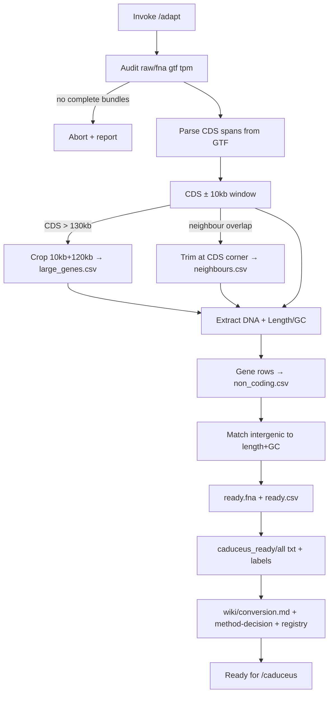

# Adapt — workflow

```mermaid
flowchart TD
  start[Invoke /adapt] --> audit[Audit raw/fna gtf tpm]
  audit -->|no complete bundles| abort[Abort + report]
  audit --> cds[Parse CDS spans from GTF]
  cds --> win[CDS ± 10kb window]
  win -->|CDS > 130kb| large[Crop 10kb+120kb → large_genes.csv]
  win -->|neighbour overlap| trim[Trim at CDS corner → neighbours.csv]
  large --> extract[Extract DNA + Length/GC]
  trim --> extract
  win --> extract
  extract --> genes[Gene rows → non_coding.csv]
  genes --> nc[Match intergenic to length+GC]
  nc --> ready[ready.fna + ready.csv]
  ready --> cad[caduceus_ready/all txt + labels]
  cad --> docs[wiki/conversion.md + method-decision + registry]
  docs --> done[Ready for /caduceus]
```

Entry point: [`src/preprocessing.py`](../../src/preprocessing.py). See [wiki/conversion.md](../../wiki/conversion.md).
