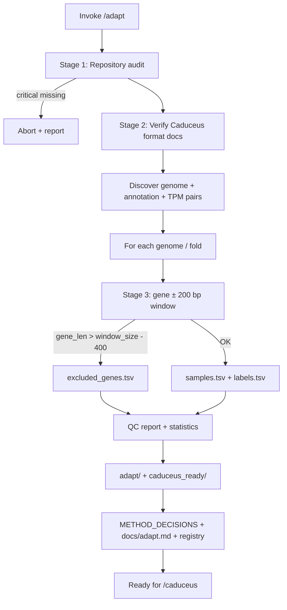

# Adapt — workflow

```mermaid
flowchart TD
  start[Invoke /adapt] --> audit[Stage 1: Repository audit]
  audit -->|critical missing| abort[Abort + report]
  audit --> fmt[Stage 2: Verify Caduceus format docs]
  fmt --> discover[Discover genome + annotation + TPM pairs]
  discover --> loop[For each genome / fold]
  loop --> win[Stage 3: gene ± 200 bp window]
  win -->|gene_len > window_size - 400| excl[excluded_genes.tsv]
  win -->|OK| accept[samples.tsv + labels.tsv]
  excl --> qc[QC report + statistics]
  accept --> qc
  qc --> out[adapt/ + caduceus_ready/]
  out --> docs[METHOD_DECISIONS + docs/adapt.md + registry]
  docs --> done[Ready for /caduceus]
```

## Command documentation

See [README.md](README.md) and [examples.md](examples.md). Entry point: [scripts/adapt.py](scripts/adapt.py).
