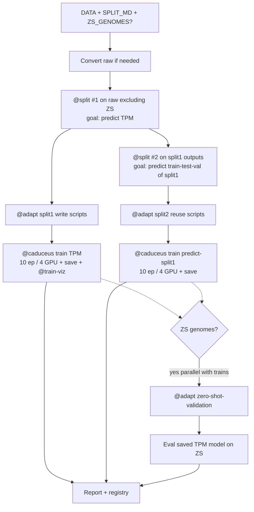

# Caduceus Full

## Required input

* data directory (random, genomes_smoketest, etc)
* type of split described in splits/*md
* if there are zero-shot-validations, which genomes to use

If any required input is missing → **stop** (missing-data-policy). Do not guess DATA or SPLIT_MD. If `splits/<id>.md` defines `zero_shot` but the user did not list ZS genomes → ask or set ZS skipped with reason.

## What does it do

* convert raw data if needed for the splits
* run @split 1 subagent on everything except zero-shot-val (use the raw data) (goal: predict TPM)
* run @split 1 on the splits 1 (goal: predict train-test-val splits 1)
* @adapt split 1, write the scripts
* @adapt split 2, reuse the scripts
* train @caduceus on the 1st split (goal: predict TPM). 10 epochs, 4 GPUs by default; save model & vizualize using
* train @caduceus on the 2nd split (goal: predict 1st split). 10 epochs, 4 GPUs by default
* if present, in parallel with train - @adapt zero-shot-validation data
* if present, run saved mode trained on the predict TPM task on the validation data

Follow: **validation-first**, **missing-data-policy**, **reproducibility**, **method-decision-tracking**, **artifact-registry**, **slurm-execution-policy**, **task-status**, `model-train.mdc`, `metrics.md`.

This skill is an **orchestrator only**. It must **not** reimplement `@split`, `@adapt`, `@caduceus`, `@data`, `@train-viz`, or `@do-fast`. Launch each as that skill requires (typically one `@do-fast` subagent per multi-step stage, or one dedicated subagent where the skill says so).

## Resolved parameters

| Param | Source | Default / notes |
|-------|--------|-----------------|
| `DATA` | user | e.g. `random`, `genomes_smoketest` |
| `SPLIT_MD` | user | `splits/<id>.md` |
| `ZS_GENOMES` | user if zero-shot | genome IDs / paths held out from Split-1 |
| `SEED` | user or Locked | **42** unless overridden |
| `EPOCHS` | user | **10** |
| `GPUS` | user | **4** |
| `RUN` | generated | e.g. `cf_<splitid>_<YYYYMMDD>` |
| `OUT_SPLIT1` | derived | `data_splits/caduceus_full/<RUN>/split1` |
| `OUT_SPLIT2` | derived | `data_splits/caduceus_full/<RUN>/split2` |
| `OUT_ADAPT1` | derived | `adapt/caduceus_full/<RUN>/split1` |
| `OUT_ADAPT2` | derived | `adapt/caduceus_full/<RUN>/split2` |
| `OUT_ADAPT_ZS` | derived | `adapt/caduceus_full/<RUN>/zero_shot` |
| `RUN_TPM` | derived | `runs/caduceus_full/<RUN>/tpm` |
| `RUN_SPLITPRED` | derived | `runs/caduceus_full/<RUN>/predict_split1` |
| `VIZ_TPM` | derived | `figures/train-viz/caduceus_full/<RUN>/tpm` |

Record all resolved params in `method-decision.md` and `docs/caduceus-full-report.md`.

## Stage map



## Workflow checklist

```
caduceus-full:
- [ ] 0. Parse DATA, SPLIT_MD, ZS_GENOMES; fail early if missing
- [ ] 1. Convert raw data if needed for the splits
- [ ] 2. @split #1 subagent: everything except zero-shot-val (raw); goal predict TPM → OUT_SPLIT1
- [ ] 3. @split #2 on OUT_SPLIT1; goal predict train-test-val splits 1 → OUT_SPLIT2
- [ ] 4. @adapt split 1 (write the scripts) → OUT_ADAPT1
- [ ] 5. @adapt split 2 (reuse the scripts) → OUT_ADAPT2
- [ ] 6. Train @caduceus on 1st adapted split (TPM), 10 epochs, 4 GPUs; save model; @train-viz
- [ ] 7. Train @caduceus on 2nd adapted split (predict 1st split), 10 epochs, 4 GPUs; save model
- [ ] 8. If ZS present: in parallel with trains, @adapt zero-shot-validation → OUT_ADAPT_ZS
- [ ] 9. If ZS present: run saved TPM model on ZS validation; log metrics.md
- [ ] 10. Write docs/caduceus-full-report.md; register artifacts
```

## Stage details

### 0 — Inputs

1. Resolve `DATA` path (project-relative).
2. Resolve `SPLIT_MD` (`splits/<id>.md` by id/name/alias).
3. If zero-shot is requested or `SPLIT_MD` has a zero_shot role: require `ZS_GENOMES` list; hold those genomes out of Split-1 raw pool.
4. Create `RUN` id; reset `docs/do-fast-checkpoint.md` for this run when starting a new graph.

### 1 — Convert raw data if needed

If DATA is not yet fold-/region-ready for `@split`:

- Prefer `@data` / `@get-data` when assets missing
- Prefer `@genome-tpm-caduceus-reformat` / `@genome-fna-gtf-reformat` when pairing/conversion needed
- Record conversions in `method-decision.md`
- Never invent TPM or sequences

### 2 — `@split` #1 (subagent) — goal: predict TPM

Invoke **`@split`** once (via its own `@do-fast` handoff as that skill requires):

| Field | Value |
|-------|-------|
| DATA | raw / converted panel **excluding** `ZS_GENOMES` |
| SPLIT_MD | user split |
| OUT | `OUT_SPLIT1` |
| Prediction | **TPM** (default) |
| Goal | predict TPM |

One subagent orchestration for this split stage — do not merge with Split-2.

### 3 — `@split` #2 on splits 1 — goal: predict train-test-val splits 1

Invoke **`@split`** again:

| Field | Value |
|-------|-------|
| DATA | `OUT_SPLIT1` (outputs of split 1) |
| SPLIT_MD | same strategy unless user overrides |
| OUT | `OUT_SPLIT2` |
| Prediction / labels | derived so the learning target is **split-1 fold assignment** (train/val/test of split 1), not TPM |
| Goal | predict train-test-val splits 1 |

Ensure region IDs remain linkable to split-1 membership. Document label encoding in `method-decision.md` (e.g. class ids for train/val/test of split 1, or ordinal targets).

### 4–5 — `@adapt` split 1 and split 2

* `@adapt` on Split-1 fold tree → `OUT_ADAPT1` (**write the scripts** if missing; then run them / `adapt.py`)
* `@adapt` on Split-2 fold tree → `OUT_ADAPT2` (**reuse the scripts**; same `window_size` / flank Locked in adapt)

Do not reimplement windowing. Pass `--input` to each split root; keep folds.

### 6 — Train `@caduceus` on 1st split (TPM)

* Goal: **predict TPM**
* Defaults: **10 epochs**, **4 GPUs**
* Metrics: project **`metrics.md`** every epoch (train/val/test)
* Save final model under `RUN_TPM/final_model/`
* Visualize with **`@train-viz`** on the training log(s) → `VIZ_TPM`
* Monitor per `model-train.mdc` (10 min) via `@do-fast` / `@monitor` when jobs are long
* SLURM when required (`--gpus` / multi-GPU torchrun)

### 7 — Train `@caduceus` on 2nd split (predict 1st split)

* Goal: **predict 1st split** (split-1 fold / train-test-val membership)
* Defaults: **10 epochs**, **4 GPUs**
* Save under `RUN_SPLITPRED/final_model/`
* Log task-appropriate metrics (classification accuracy if fold-class target) **and** any regression heads per `metrics.md` when applicable
* May run after or overlapping Stage 6 only if resources allow; default: sequential if 4 GPUs already used by TPM train, else parallel when cluster capacity permits — record choice

### 8 — Zero-shot adapt (parallel with train)

If `ZS_GENOMES` present:

* While Stage 6/7 train, run **`@adapt`** on zero-shot-validation genomes only → `OUT_ADAPT_ZS`
* Same adapt scripts / config as Stage 4–5

### 9 — Zero-shot eval with saved TPM model

If ZS present and Stage 6 model saved:

* Run the **saved TPM model** on `OUT_ADAPT_ZS` validation sequences
* Log `metrics.md` suite to `RUN_TPM/zero_shot_metrics.json`
* Do not use the split-1-predictor model for this step unless the user asks

### 10 — Report

Write `docs/caduceus-full-report.md`:

```markdown
# Caduceus-full report
**RUN:** …
**DATA / SPLIT_MD / ZS:** …
## Split1 (TPM) … OUT_SPLIT1 / OUT_ADAPT1 / RUN_TPM / VIZ
## Split2 (predict split1) … OUT_SPLIT2 / OUT_ADAPT2 / RUN_SPLITPRED
## Zero-shot … adapted? metrics?
## Blockers …
```

Register all outs in `docs/artifact-registry.md`.

## Execution pattern

Prefer materializing a **chunky** `todo.md` for the full graph, then one **`@do-fast`** for the whole `caduceus-full` run **or** sequential `@do-fast` / subagent calls per stage (Split-1, Split-2, Adapt-1, Adapt-2, Train-TPM, Train-SplitPred, ZS-adapt, ZS-eval) if resource isolation is clearer.

When using one graph, mark ZS-adapt **READY** in parallel with Train-TPM (no dependency on train completion); ZS-eval **Depends on** Train-TPM + ZS-adapt.

## Rules

- Never invent DATA, SPLIT_MD, ZS genomes, TPM, or metrics.
- Never skip `@adapt` scripts for Caduceus-ready windows when training needs them.
- Split-1 excludes zero-shot genomes from the raw pool.
- Defaults: **10 epochs**, **4 GPUs**, seed **42** unless Locked otherwise.
- TPM train must follow `metrics.md`; visualize TPM run with `@train-viz`.
- Orchestrator only — delegate to existing skills.

## Coordination

| Skill | Role |
|-------|------|
| `@data` / `@get-data` | Acquire missing raw assets |
| `@genome-tpm-caduceus-reformat` / `@genome-fna-gtf-reformat` | Convert/pair before split |
| `@split` | Split-1 (TPM) and Split-2 (predict split1) |
| `@adapt` | Adapt split1, split2, and optional ZS |
| `@caduceus` | Both trains + ZS inference facts |
| `@train-viz` | Visualize TPM training logs |
| `@do-fast` | Multi-step execution engine |
| `metrics.md` | Epoch / ZS regression metrics |
| `model-train.mdc` | Epochs, checkpoint, monitor 10 min |

## Additional resources

- [examples.md](examples.md)
- [workflow.md](workflow.md)
- Split: `../split/SKILL.md`
- Adapt: `../adapt/SKILL.md`
- Caduceus: `../caduceus/SKILL.md`
- Train-viz: `../train-viz/SKILL.md`
