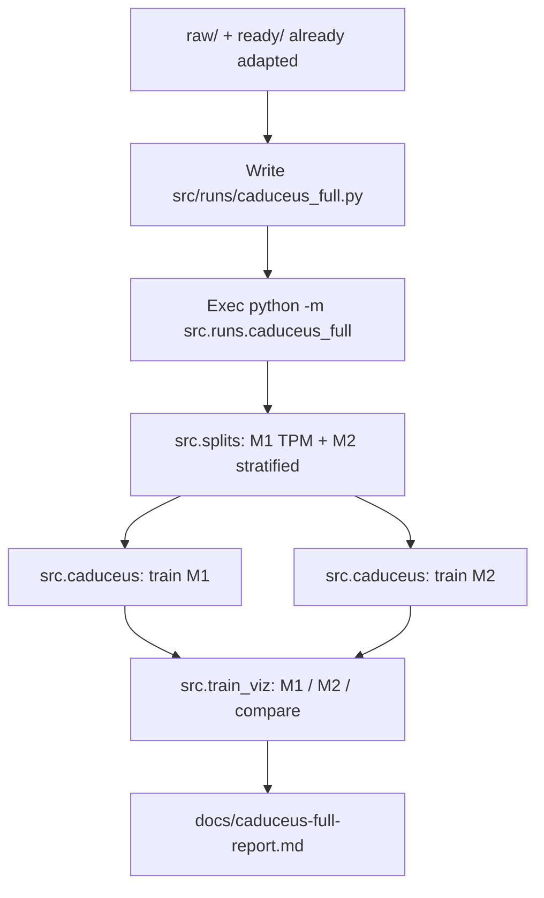

# Caduceus Full

## Required input

* **ready** data already prepared (`ready/` / `data_ready/`) — **no `@adapt`**
* **raw/** available for split strategies that need genomic metadata
* split strategy in `splits/*.md` (default `random`)

If `ready/` is missing → **stop** (missing-data-policy). Do not run `@adapt` inside this skill.

## What it does

1. **Write / update** `src/runs/caduceus_full.py` (thin imports only)
2. **Exec** that script (re-runnable later **without subagents**)
3. Pipeline inside the script:
   * `/split` → `src.splits.random.run_random_split` → `splits/<id>/{M1,M2}`
   * `/caduceus` → `src.caduceus.run` on **M1** (TPM) then **M2** (predict M1 fold)
   * `/train-viz` → `src.train_viz.viz.main` on M1 (and M2 + compare)

## Code-first contract (LOCKED)

```
@caduceus-full:
  1. Confirm raw/ + ready/ present (already adapted)
  2. WRITE/UPDATE src/runs/caduceus_full.py (imports only — no reimplemented trainers)
  3. EXEC: python -m src.runs.caduceus_full --strategy random --epochs 10 --seed 42
  4. REUSE the same script for future runs (no subagents required)
```

Do **not** reimplement split / caduceus / train-viz logic here. Import their `run` / `main` APIs.

## Exact command

```bash
conda run -n caduceus_env python -m src.runs.caduceus_full \
  --strategy random \
  --raw raw \
  --ready ready \
  --seed 42 \
  --epochs 10

# Smoke
python -m src.runs.caduceus_full --max-samples 32 --epochs 1 --no-m2

# Multi-GPU train stages (optional): run caduceus steps via torchrun separately,
# or set CUDA_VISIBLE_DEVICES; the orchestrator calls src.caduceus.run in-process.
```

| Flag | Default | Notes |
|------|---------|-------|
| `--strategy` | `random` | `splits/<id>.md` |
| `--raw` / `--ready` | `raw` / auto | Ready must already exist |
| `--epochs` | **10** | Per train |
| `--seed` | **42** | |
| `--skip-split` / `--skip-train` / `--skip-viz` | off | Resume helpers |
| `--no-m2` | off | TPM-only path |
| `--max-samples` | none | Smoke cap |

## Resolved paths

| Param | Path |
|-------|------|
| Split | `splits/<strategy>/{M1,M2}/` |
| Train M1 | `runs/caduceus/<tag>_M1/` |
| Train M2 | `runs/caduceus/<tag>_M2/` |
| Viz | `figures/train-viz/<tag>_M1/` (+ M2 + compare) |
| Report | `docs/caduceus-full-report.md` |

## Stage map



## Workflow checklist

```
caduceus-full:
- [ ] Confirm ready/ (no adapt) + raw/
- [ ] Update src/runs/caduceus_full.py if wiring must change
- [ ] Exec python -m src.runs.caduceus_full …
- [ ] Verify splits/ + runs/caduceus/ + figures/train-viz/
- [ ] method-decision + artifact-registry + docs/caduceus-full-report.md
```

## Rules

- **No `@adapt`** — windows/TPM already in `ready/`
- Never invent data, metrics, or fold labels
- Orchestrator = **small imports + `run`/`main` calls** only
- Defaults: **10 epochs**, seed **42**
- TPM train follows `metrics.md` (via `src.caduceus`); viz via `src.train_viz`
- Future re-runs: exec `src/runs/caduceus_full.py` directly — **no subagents required**

## Coordination

| Module | Role |
|--------|------|
| `src/runs/caduceus_full.py` | This pipeline |
| `src/splits/` | `/split` |
| `src/caduceus.py` | `/caduceus` |
| `src/train_viz/` | `/train-viz` |
| `src/preprocessing.py` | Prior `@adapt` only (not invoked here) |

## Additional resources

- [examples.md](examples.md)
- [workflow.md](workflow.md)
- Script: [`src/runs/caduceus_full.py`](../../src/runs/caduceus_full.py)
