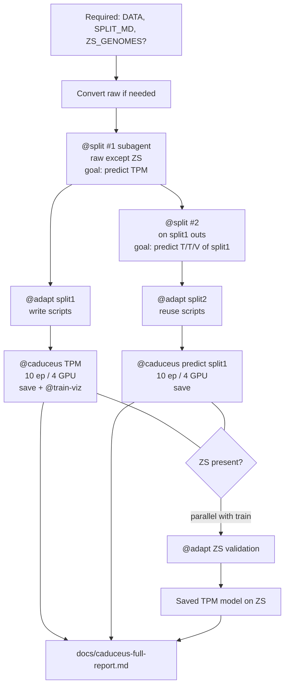

# Caduceus-full — workflow

```mermaid
flowchart TD
  req[Required: DATA, SPLIT_MD, ZS_GENOMES?] --> conv[Convert raw if needed]
  conv --> split1["@split #1 subagent\nraw except ZS\ngoal: predict TPM"]
  split1 --> split2["@split #2\non split1 outs\ngoal: predict T/T/V of split1"]
  split1 --> adapt1["@adapt split1\nwrite scripts"]
  split2 --> adapt2["@adapt split2\nreuse scripts"]
  adapt1 --> trainTPM["@caduceus TPM\n10 ep / 4 GPU\nsave + @train-viz"]
  adapt2 --> trainS1["@caduceus predict split1\n10 ep / 4 GPU\nsave"]
  zs{ZS present?}
  trainTPM --- zs
  trainS1 --- zs
  zs -->|parallel with train| adaptZS["@adapt ZS validation"]
  adaptZS --> evalZS["Saved TPM model on ZS"]
  trainTPM --> report[docs/caduceus-full-report.md]
  trainS1 --> report
  evalZS --> report
```
