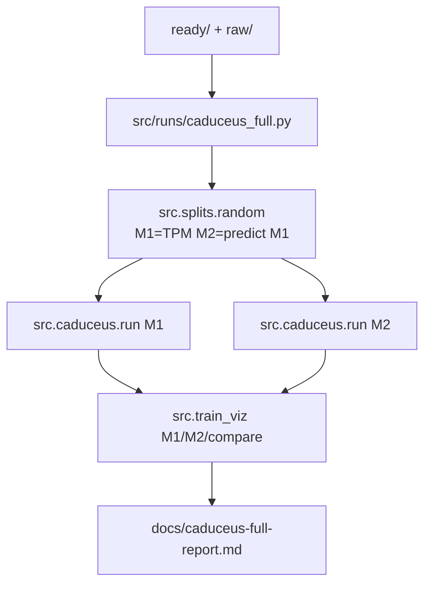

# Caduceus-full — workflow

```mermaid
flowchart TD
  ready[ready/ + raw/] --> script[src/runs/caduceus_full.py]
  script --> split["src.splits.random\nM1=TPM M2=predict M1"]
  split --> m1["src.caduceus.run M1"]
  split --> m2["src.caduceus.run M2"]
  m1 --> viz["src.train_viz M1/M2/compare"]
  m2 --> viz
  viz --> report[docs/caduceus-full-report.md]
```

No `@adapt`. Re-run: `python -m src.runs.caduceus_full …` (no subagents).
