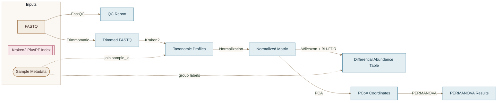
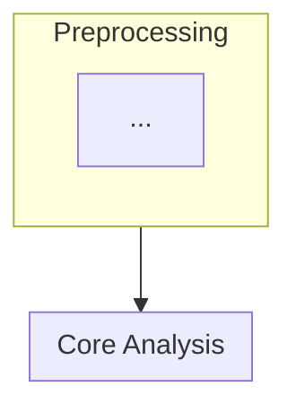
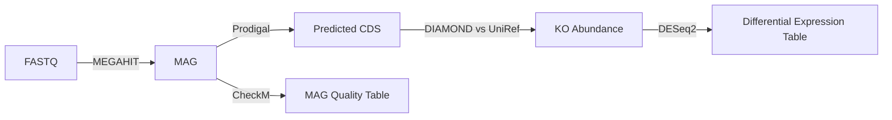

# Mermaid Architecture Templates

## Nature theme (project default)

Use soft earth tones via `%%{init}%%` + `classDef`. Apply to every workflow diagram in README / wiki / architecture reports.

**Convention:** put **process / tool names on arrows** (`A -->|adapt| B`), not as intermediate nodes. Use empty join cells for multi-input merges. README: data objects only — no exact folder trees (those belong in architecture).

| Class | Hex fill / stroke | Role |
|-------|-------------------|------|
| `earth` | `#F4EDE4` / `#A67C52` | Raw inputs (FASTQ, GTF, FNA, tables) |
| `ocean` | `#E3EEF3` / `#5B8FA8` | Intermediate artifacts |
| `liposome` | `#F8E8EC` / `#C47A8A` | Models, figures, final outputs |
| `moss` | `#EEF3E8` / `#7A9E5A` | Generated code / helpers |
| `detail` | `#FBF8F4` / `#C4B5A0` | Path / schema annotations |
| `join` | transparent / dashed | Empty merge points |
| `inferred` | dashed stroke | Inferred edges |



## Edge Style Conventions

| Evidence | Mermaid syntax | Label suffix |
|----------|----------------|--------------|
| Verified | `-->|Tool|` | none |
| Inferred | `-.->|Tool (inferred)|` | `(inferred)` |
| Tentative method | `-.->|Tool (?)|` | from method-decision Open |

## Node Naming Rules

- Use **generic scientific names**, not raw filenames: `FASTQ` not `sample_R1.fq.gz`
- Filenames go in uncertainty report or footnote, not node labels
- Plural for sample-level collections: `Taxonomic Profiles`, `Gene Counts`
- Singular for reference assets: `Reference Genome`, `Protein DB`

## Node Shape Reference


Syntax:
- `[Text]` rectangle — files, primary data objects
- `([Text])` stadium — metadata, cohort descriptors
- `[[Text]]` double rectangle — reference databases, indices
- `(Text)` rounded — derived matrices, model objects

## Phase Subgraph Template



Split when total nodes > ~40 or edges become unreadable.

## Multi-Omics Example (abbreviated)



## Output File Wrapper

Save diagram in markdown:

```markdown
# Workflow Architecture

**Generated:** YYYY-MM-DD
**Source:** Repository scan + method-decision.md
**Coverage:** N verified edges, M inferred edges

## Diagram

​```mermaid
flowchart LR
    ...
​```

## Legend
| Symbol | Meaning |
|--------|---------|
| Solid arrow | Verified in workflow code/config |
| Dashed arrow | Inferred from project structure |
| [[ ]] | Reference database |
| ([ ]) | Metadata |

## Uncertainty Report
[See gaps template below]
```

## Uncertainty Report Template

```markdown
## Workflow reconstruction gaps

### Unconnected artifacts
| Path | Likely type | Issue |
|------|-------------|-------|
| results/beta_pcoa.tsv | PCoA Coordinates | No upstream rule found in Snakefile |

### Inferred links (confirm)
| From | To | Edge label | Basis |
|------|-----|------------|-------|
| Trimmed FASTQ | Taxonomic Profiles | Kraken2 (inferred) | Output dir naming; rule commented out |

### Conflicts
| Source A | Source B | Conflict |
|----------|----------|----------|
| Snakefile | README | README lists MetaPhlAn; code uses Kraken2 |

### Required to complete diagram
- [ ] Confirm host removal step exists or remove node
- [ ] Provide script for `scripts/orphan_step.R`
```

## Readability Guidelines

- Max ~25–40 nodes per diagram; split if larger
- Edge labels: tool name only; params in uncertainty report unless critical
- Avoid crossing edges: reorder nodes or use subgraphs
- Branching: use explicit merge nodes (`Merged Count Matrix`) not implicit joins
- ML flows: show `Feature Matrix -->|XGBoost| Trained Model -->|predict| Predictions`

## Anti-Patterns

| Avoid | Prefer |
|-------|--------|
| Idealized pipeline not in repo | Only verified + strongly inferred edges |
| Raw paths as node labels | Generic object names |
| Invented tool on edge | Unknown → gap report |
| Single giant unreadable graph | Phase subgraphs |
| Hiding inferred edges | Dashed + uncertainty report |
