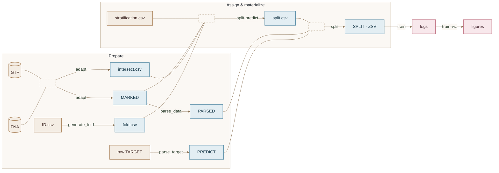

# GigaMario

Toolkit for preparing genomic intervals, linking prediction targets, building leakage-aware train/val/test partitions, and training DNA foundation models (Caduceus, LegNet, …).

| Doc | Role |
|-----|------|
| [wiki/architecture.md](wiki/architecture.md) | Pipeline contracts (`MARKED` → `PARSED` → `PREDICT` → `SPLIT`) |
| [wiki/sbs.md](wiki/sbs.md) | Split-by-similarity (feature tables + clustering) |
| [wiki/split-generate.md](wiki/split-generate.md) | Authoring strategies from `splits/*.md` |
| [skills.md](skills.md) | Cursor skill index |

## Skill pipeline

```mermaid
%%{init: {'theme':'base','themeVariables':{'primaryColor':'#E8F0E6','primaryTextColor':'#2C3E2D','primaryBorderColor':'#6B8F71','lineColor':'#8B7355','secondaryColor':'#E3EEF3','tertiaryColor':'#F4EDE4','clusterBkg':'#FBF8F4','clusterBorder':'#C4B5A0','edgeLabelBackground':'#FBF8F4','fontFamily':'ui-sans-serif, system-ui, sans-serif'}}}%%
flowchart TD
    raw[GTF + FNA + TARGET] -->|/preprocess| arts[ID.csv · MARKED · PARSED · PREDICT · parse.md]
    caption[splits/*.md] -->|/split-generate| stratCode[src/splits/{id}.py]
    arts -->|/split| SPLIT[SPLIT · optional ZSV]
    stratCode -->|/split| SPLIT
    SPLIT -->|/train| logs[logs · TensorBoard · figures · final_model]
    SPLIT -->|/adversarial| ADVpanel[adversarial panel + random SPLIT]
    ADVpanel -->|/train mode=adversarial| logsAdv[logs · figures · final_model]
    PIPE["/pipeline dry|run"] -.-> SPLIT
    PIPE -.-> logs
    PIPE -.-> ADVpanel

    classDef earth fill:#F4EDE4,stroke:#A67C52,stroke-width:1.5px,color:#3E2723
    classDef ocean fill:#E3EEF3,stroke:#5B8FA8,stroke-width:1.5px,color:#1A3A4A
    classDef liposome fill:#F8E8EC,stroke:#C47A8A,stroke-width:1.8px,color:#4A2C35
    classDef moss fill:#EEF3E8,stroke:#7A9E5A,stroke-width:1.8px,color:#2F3E2E

    class raw,caption earth
    class arts,SPLIT,ADVpanel,stratCode ocean
    class logs,logsAdv liposome
    class PIPE moss
```

## Stage graph (modules)

Processes are edge labels — nodes are data objects only (no folder layouts).



1. **`/preprocess`** — write-and-exec `preprocess_{data}.py`: get_mpra (optional) → id_gen/id_rule → adapt → parse_data → parse_target → optional generate_fold → `preprocess_report` → `parse.md`.
2. **`/split-generate`** — implement strategies from `splits/*.md` into `src/splits/`.
3. **`/split`** — split-predict + split via `src/run/run_id/…`.
4. **`/train`** — reuse `src.pipeline.train` / caduceus / legnet / train_viz; TensorBoard; optional ZSV eval.
5. **`/adversarial`** — adversarial combine + random split.
6. **`/pipeline`** — `src/run/run_id/pipeline.py` with `dry` (generate/review/smoke) or `run` (execute).

## Install (conda-preferred)

```bash
source ~/miniconda3/etc/profile.d/conda.sh
conda activate base
conda env update -f environment.yml --prune
python -m pip install -e .
```

## Archive

Prior run outputs live under [`archive/results/`](archive/results/) (gitignored). Legacy skills under [`archive/skills/`](archive/skills/).
