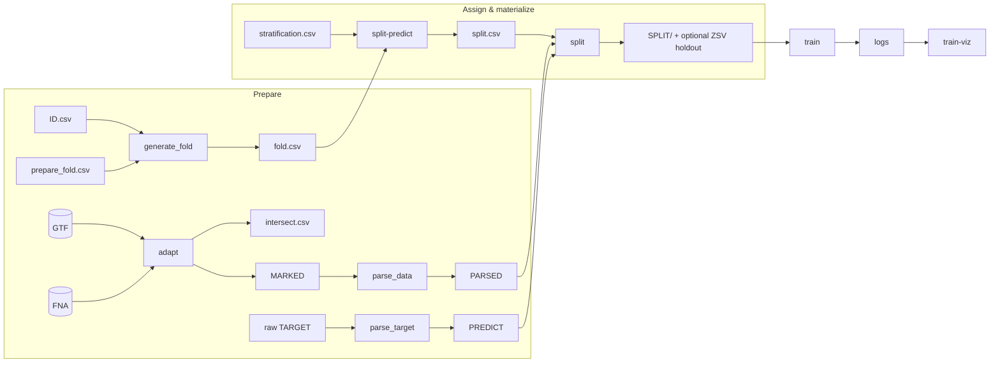

# GigaMario

Toolkit for preparing genomic intervals, linking prediction targets, building leakage-aware train/val/test partitions, and training DNA foundation models (Caduceus, LegNet, …).

## What it does

Stages under `src/pipeline/` walk raw genomes and annotations through a fixed graph. Contracts and column schemas: [wiki/architecture.md](wiki/architecture.md). Migration notes: [refactoring.md](refactoring.md).



1. **adapt** — mark intervals (`environment` + signed `window`); write `MARKED/` + `intersect.csv`.
2. **parse_data** — model-ready `PARSED/ID.ext` (Caduceus DNA; LegNet 230 bp, skip non-200 by default).
3. **parse_target** — `PREDICT/` merged (`ID.ext`) or mapped (`{sample}/ID.ext`).
4. **generate_fold** — optional `fold.csv` from `ID.csv` + `prepare_fold.csv` rules via `id_rule` (`zsv` holdouts).
5. **generate_stratification** — stub (`Not implemented`); will build `stratification.csv` via `id_rule` when implemented.
6. **split-predict** — random assignment via `src.splits.random` helpers → `split.csv`.
7. **split** — materialize `SPLIT/`; `intersect_allow=T|F` for missing PARSED/PREDICT; ZSV → `zero-shot-validation/`.
8. **train** / **train-viz** — fine-tune and plot.

## Install (conda-preferred)

```bash
source ~/miniconda3/etc/profile.d/conda.sh
conda activate base
conda env update -f environment.yml --prune
```

Editable install:

```bash
python -m pip install -e .
```

Verify:

```bash
python -c "import GigaMario; print(GigaMario.__version__)"
```

Model-specific envs (`caduceus_env`, `legnet`) are used for training; see the wiki and skill docs for stage commands while the public CLI is still landing.
