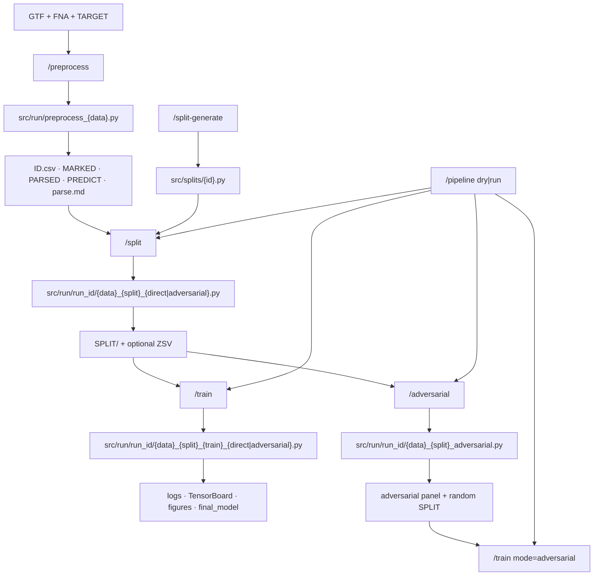
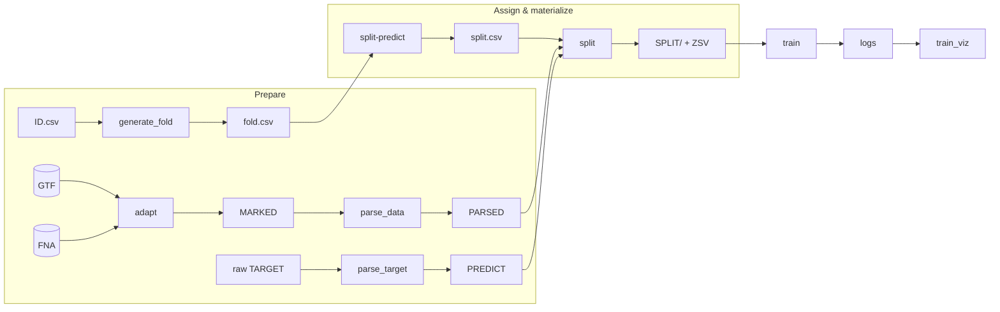

# GigaMario

Toolkit for preparing genomic intervals, linking prediction targets, building leakage-aware train/val/test partitions, and training DNA foundation models (Caduceus, LegNet, …).

Contracts: [wiki/architecture.md](wiki/architecture.md). Skills: [skills.md](skills.md). Split strategy authoring: [wiki/split-generate.md](wiki/split-generate.md).

## Skill pipeline



## Stage graph (modules)



1. **`/preprocess`** — write-and-exec `preprocess_{data}.py`: get_mpra (optional) → id_gen/id_rule → adapt → parse_data → parse_target → optional generate_fold → `preprocess_report` → `parse.md`.
2. **`/split-generate`** — implement strategies from `splits/*.md` into `src/splits/`.
3. **`/split`** — split-predict + split via `src/run/run_id/…`.
4. **`/train`** — reuse `src.pipeline.train` / caduceus / legnet / train_viz; TensorBoard; optional ZSV eval.
5. **`/adversarial`** — adversarial combine + random split.
6. **`/pipeline`** — `src/run/run_id/pipeline.py` with `dry` (generate/review/smoke) or `run` (execute).

## Install (conda-preferred)

```bash
source ~/miniconda3/etc/profile.d/conda.sh
conda activate base
conda env update -f environment.yml --prune
python -m pip install -e .
```

## Archive

Prior run outputs live under [`archive/results/`](archive/results/) (gitignored). Legacy skills under [`archive/skills/`](archive/skills/).
