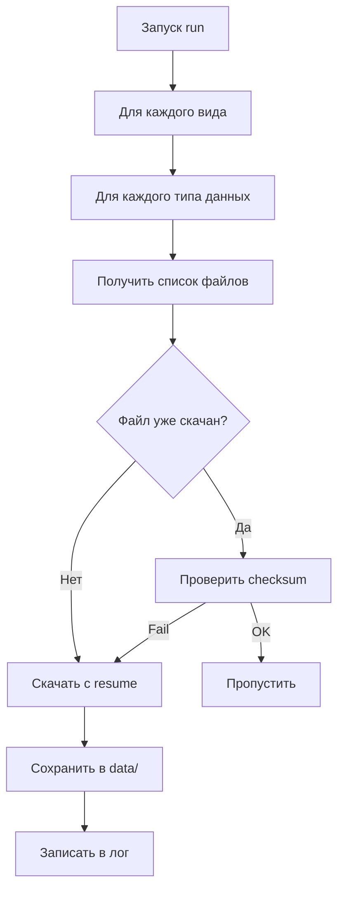
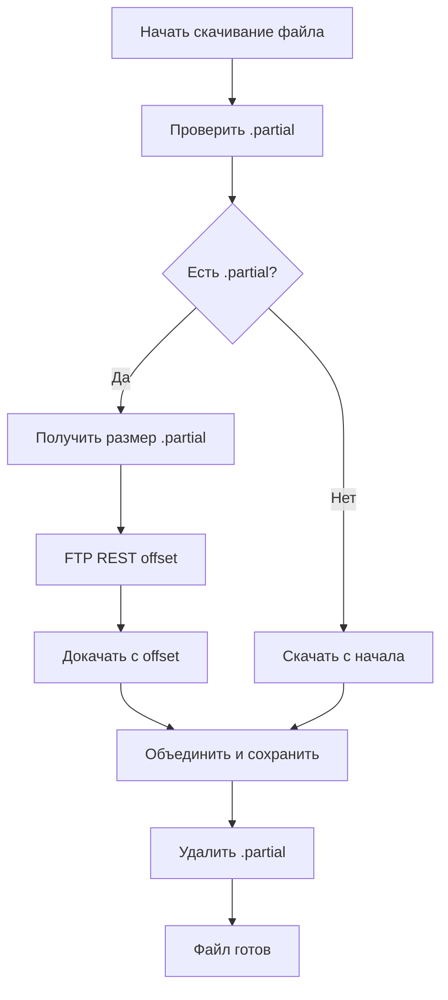
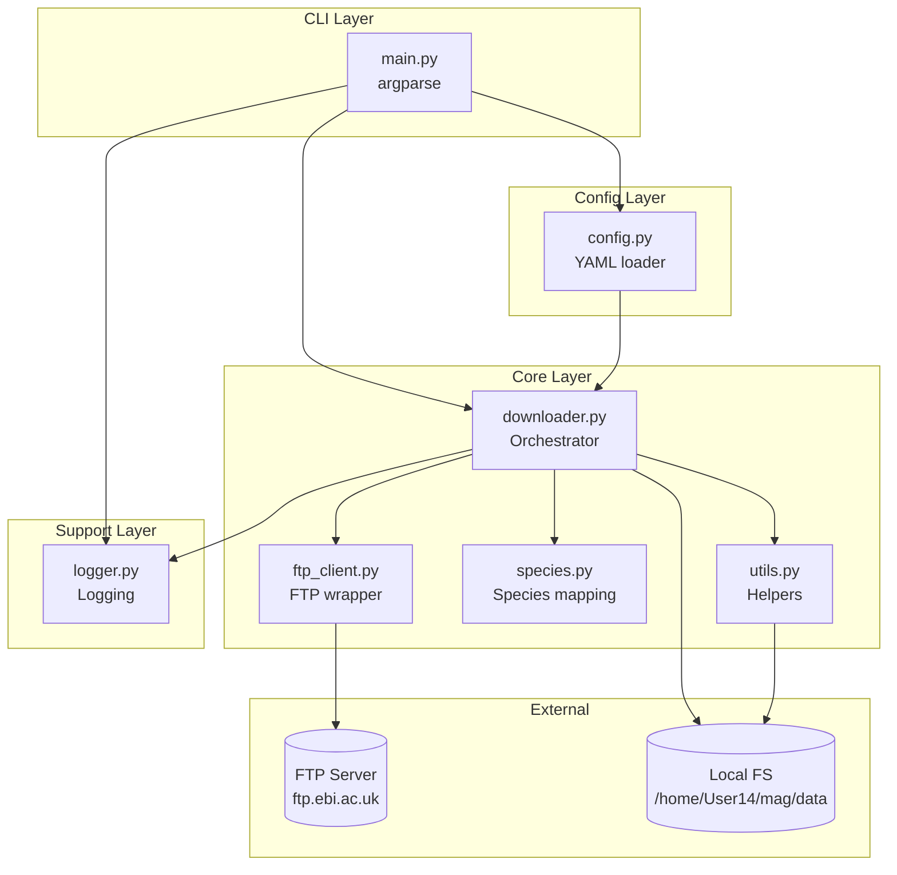

# ARCHITECTURE.md — Утилита скачивания данных с FTP Ensembl

## 1. Обзор

**Ensembl FTP Downloader** — Python-утилита для автоматизированного скачивания геномных данных с FTP Ensembl (https://ftp.ebi.ac.uk/pub/ensemblorganisms/).

**Назначение:**
- Получение FASTA-файлов геномов (DNA, cDNA, CDS, protein, ncRNA)
- Получение GTF/GFF-файлов аннотаций
- Получение Variation data (VCF)
- Получение Compara (гомология)
- Получение Regulation и Biomart (опционально)

**Целевая среда:**
- Удалённый сервер: `85.208.85.123` (пользователь `User14`)
- Рабочая директория: `/home/User14/mag`
- Ограничения: нельзя выходить за пределы `/home/User14/mag`, нельзя удалять данные на сервере

**Ключевые особенности:**
- Resume прерванных загрузок
- Проверка целостности через md5sum
- Параллельное скачивание (опционально)
- Подробное логирование
- Настраиваемые виды, релизы и типы данных через YAML-конфиг

---

## 2. Источник данных — структура FTP Ensembl

### 2.1. Базовый URL

```
https://ftp.ebi.ac.uk/pub/ensemblorganisms/
```

### 2.2. Иерархия каталогов

```
/pub/ensemblorganisms/
├── GCA/                          # GenBank assemblies
│   └── 000/001/405/29/          # GCA_000001405.29 (human GRCh38)
│       └── ensembl/
│           └── 2023_03/         # Annotation release date
│               ├── genome/      # FASTA-файлы генома
│               ├── geneset/     # GTF/GFF, cDNA, protein
│               ├── homology/    # Compara alignments
│               └── variation/   # VCF-файлы
├── GCF/                          # RefSeq assemblies
└── README                        # Описание структуры
```

### 2.3. Маппинг assembly accession → путь

Assembly accession разбивается на блоки по 3 цифры:

| Accession | Путь |
|-----------|------|
| `GCA_000001405.29` | `/GCA/000/001/405/29/` |
| `GCF_000001635.27` | `/GCF/000/001/635/27/` |

### 2.4. Форматы файлов

- `.bgz` — BGZF (Blocked GZIP), индексированный через Tabix
- `.gz` — стандартный GZIP
- `.fa` / `.fasta` — FASTA-последовательности
- `.gtf` / `.gff3` — аннотации генов
- `.vcf` / `.vcf.gz` — варианты
- `.tsv` — таблицы гомологии
- `md5sum.txt` — контрольные суммы

---

## 3. Скачиваемые данные

### 3.1. Таблица типов файлов

| Тип файла | Путь на FTP | Описание | Пример имени |
|-----------|-------------|----------|--------------|
| **Genome DNA (softmasked)** | `<assembly>/ensembl/<date>/genome/` | Мягко замаскированный геном | `softmasked.fa.bgz` |
| **Genome DNA (hardmasked)** | `<assembly>/ensembl/<date>/genome/` | Жёстко замаскированный геном | `hardmasked.fa.bgz` |
| **Genome DNA (unmasked)** | `<assembly>/ensembl/<date>/genome/` | Незамаскированный геном | `unmasked.fa.bgz` |
| **GTF annotation** | `<assembly>/ensembl/<date>/geneset/` | Аннотация генов (GTF) | `genes.gtf.gz` |
| **GFF3 annotation** | `<assembly>/ensembl/<date>/geneset/` | Аннотация генов (GFF3) | `genes.gff3.gz` |
| **cDNA FASTA** | `<assembly>/ensembl/<date>/geneset/` | Кодирующие транскрипты | `cdna.fa.bgz` |
| **CDS FASTA** | `<assembly>/ensembl/<date>/geneset/` | Кодирующие последовательности | `cds.fa.bgz` |
| **Protein FASTA** | `<assembly>/ensembl/<date>/geneset/` | Белковые последовательности | `pep.fa.bgz` |
| **ncRNA FASTA** | `<assembly>/ensembl/<date>/geneset/` | Некодирующие РНК | `ncrna.fa.bgz` |
| **EMBL annotation** | `<assembly>/ensembl/<date>/geneset/` | EMBL-формат аннотации | `genes.embl.gz` |
| **XRef mappings** | `<assembly>/ensembl/<date>/geneset/` | Кросс-ссылки идентификаторов | `xref.tsv.gz` |
| **Variation VCF** | `<assembly>/ensembl/<date>/variation/<release>/` | Варианты (VCF) | `<species>.vcf.gz` |
| **Homology TSV** | `<assembly>/ensembl/<date>/homology/<release>/` | Гомология (Compara) | `homology.tsv.gz` |
| **md5sum** | `<assembly>/ensembl/<date>/<subdir>/` | Контрольные суммы | `md5sum.txt` |

### 3.2. Виды по умолчанию

| Вид | Assembly | GCA Accession |
|-----|----------|---------------|
| `homo_sapiens` | GRCh38 | `GCA_000001405.29` |
| `mus_musculus` | GRCm39 | `GCA_000001635.9` |
| `danio_rerio` | GRCz11 | `GCA_000002035.6` |

Список настраивается через `config.yaml`.

### 3.3. Релизы

- По умолчанию: последний стабильный релиз (определяется через JSON manifest)
- Возможность указать конкретный релиз (например, `release-110`)
- Формат даты аннотации: `YYYY_MM` (например, `2023_03`)

---

## 4. Структура каталогов на сервере

```
/home/User14/mag/
├── src/                          # Исходный код утилиты
│   ├── __init__.py
│   ├── main.py                   # CLI-точка входа
│   ├── config.py                 # Загрузка и валидация конфигурации
│   ├── ftp_client.py             # Обёртка над ftplib
│   ├── downloader.py             # Основная логика скачивания
│   ├── logger.py                 # Настройка логирования
│   ├── species.py                # Маппинг видов → assembly accessions
│   └── utils.py                  # Вспомогательные функции (checksum, resume)
│
├── config/                       # Конфигурация
│   ├── config.yaml               # Основной конфиг
│   └── species.yaml              # Маппинг видов (опционально)
│
├── data/                         # Скачанные данные
│   ├── homo_sapiens/
│   │   ├── GCA_000001405.29/
│   │   │   ├── genome/
│   │   │   │   ├── softmasked.fa.bgz
│   │   │   │   ├── softmasked.fa.bgz.md5
│   │   │   │   └── md5sum.txt
│   │   │   ├── geneset/
│   │   │   │   ├── genes.gtf.gz
│   │   │   │   ├── genes.gff3.gz
│   │   │   │   ├── cdna.fa.bgz
│   │   │   │   ├── cds.fa.bgz
│   │   │   │   ├── pep.fa.bgz
│   │   │   │   └── ncrna.fa.bgz
│   │   │   ├── variation/
│   │   │   │   └── homo_sapiens.vcf.gz
│   │   │   └── homology/
│   │   │       └── homology.tsv.gz
│   │   └── README.md
│   ├── mus_musculus/
│   │   └── GCA_000001635.9/
│   │       └── ...
│   └── danio_rerio/
│       └── GCA_000002035.6/
│           └── ...
│
├── logs/                         # Логи
│   ├── download_2026-07-29.log
│   ├── download_2026-07-30.log
│   └── errors.log
│
├── tmp/                          # Временные файлы (неполные загрузки)
│   └── homo_sapiens.softmasked.fa.bgz.partial
│
├── README.md                     # Описание утилиты
├── requirements.txt              # Зависимости Python
└── run.sh                        # Скрипт запуска
```

---

## 5. Модули утилиты

### 5.1. `src/config.py`

**Назначение:** Загрузка, валидация и предоставление доступа к конфигурации.

**Классы/функции:**

```python
class Config:
    """Загружает config.yaml и предоставляет типизированный доступ."""
    
    def __init__(self, config_path: Path):
        self.ftp_base: str = "https://ftp.ebi.ac.uk/pub/ensemblorganisms"
        self.species: List[str] = ["homo_sapiens", "mus_musculus", "danio_rerio"]
        self.release: Optional[int] = None  # None = последний
        self.data_types: List[str] = ["genome", "geneset", "variation", "homology"]
        self.output_dir: Path = Path("/home/User14/mag/data")
        self.log_dir: Path = Path("/home/User14/mag/logs")
        self.parallel: int = 1  # Количество параллельных потоков
        self.resume: bool = True
        self.verify_checksum: bool = True
        self.timeout: int = 300  # секунды
    
    def get_assembly_path(self, species: str) -> str:
        """Возвращает путь assembly для вида."""
    
    def get_file_list(self, species: str, data_type: str) -> List[str]:
        """Возвращает список файлов для скачивания."""
```

**Формат:** YAML (см. раздел 6).

---

### 5.2. `src/ftp_client.py`

**Назначение:** Обёртка над `ftplib` с поддержкой прогресса, resume и обработки ошибок.

**Классы/функции:**

```python
class FTPClient:
    """Обёртка над ftplib с дополнительными возможностями."""
    
    def __init__(self, host: str = "ftp.ebi.ac.uk", timeout: int = 300):
        self.ftp = ftplib.FTP()
        self.timeout = timeout
    
    def connect(self) -> None:
        """Устанавливает соединение (анонимный доступ)."""
    
    def disconnect(self) -> None:
        """Закрывает соединение."""
    
    def list_files(self, remote_path: str) -> List[str]:
        """Возвращает список файлов в директории."""
    
    def file_exists(self, remote_path: str) -> bool:
        """Проверяет существование файла."""
    
    def get_file_size(self, remote_path: str) -> int:
        """Возвращает размер файла в байтах."""
    
    def download_file(
        self,
        remote_path: str,
        local_path: Path,
        resume: bool = True,
        progress_callback: Optional[Callable] = None
    ) -> None:
        """Скачивает файл с поддержкой resume и прогресса."""
    
    def _download_with_resume(self, remote_path: str, local_path: Path, 
                              progress_callback: Optional[Callable]) -> None:
        """Внутренний метод для докачки."""
```

**Особенности:**
- Анонимный FTP-доступ (`anonymous` / пустой пароль)
- Поддержка `REST` команды для resume
- Callback для прогресс-бара (tqdm)
- Автоматическое переподключение при обрыве

---

### 5.3. `src/downloader.py`

**Назначение:** Основная логика скачивания — оркестрация FTP-клиента, конфигурации и логирования.

**Классы/функции:**

```python
class Downloader:
    """Оркестратор процесса скачивания."""
    
    def __init__(self, config: Config, logger: Logger):
        self.config = config
        self.logger = logger
        self.ftp_client = FTPClient()
    
    def download_species(self, species: str) -> DownloadResult:
        """Скачивает все данные для одного вида."""
    
    def download_data_type(
        self, 
        species: str, 
        data_type: str
    ) -> List[DownloadResult]:
        """Скачивает конкретный тип данных для вида."""
    
    def download_file(
        self, 
        remote_path: str, 
        local_path: Path
    ) -> DownloadResult:
        """Скачивает один файл с проверкой и resume."""
    
    def verify_checksum(self, local_path: Path, md5_path: Path) -> bool:
        """Проверяет md5-сумму скачанного файла."""
    
    def run(self) -> None:
        """Запускает скачивание для всех видов и типов данных."""
```

**Поток выполнения:**



---

### 5.4. `src/logger.py`

**Назначение:** Настройка логирования в файл и консоль.

**Функции:**

```python
def setup_logger(
    log_dir: Path,
    log_level: str = "INFO",
    console: bool = True
) -> logging.Logger:
    """Создаёт и настраивает логгер."""
    
    # Логгер пишет в:
    # - logs/download_YYYY-MM-DD.log (все сообщения)
    # - logs/errors.log (только ошибки)
    # - stdout (если console=True)
```

**Формат логов:**

```
2026-07-29 14:05:07 [INFO] downloader: Starting download for homo_sapiens
2026-07-29 14:05:08 [INFO] ftp_client: Connected to ftp.ebi.ac.uk
2026-07-29 14:05:10 [INFO] downloader: Downloading softmasked.fa.bgz (3.1 GB)
2026-07-29 14:15:23 [INFO] downloader: Downloaded softmasked.fa.bgz in 10m 13s
2026-07-29 14:15:24 [INFO] downloader: Checksum verified for softmasked.fa.bgz
```

---

### 5.5. `src/main.py`

**Назначение:** CLI-точка входа с argparse.

**Аргументы CLI:**

```python
import argparse

parser = argparse.ArgumentParser(
    description="Ensembl FTP Downloader"
)
parser.add_argument(
    "--config", 
    type=Path, 
    default=Path("config/config.yaml"),
    help="Путь к конфигурации"
)
parser.add_argument(
    "--species", 
    nargs="+", 
    help="Список видов (переопределяет конфиг)"
)
parser.add_argument(
    "--data-types", 
    nargs="+", 
    choices=["genome", "geneset", "variation", "homology"],
    help="Типы данных для скачивания"
)
parser.add_argument(
    "--release", 
    type=int, 
    help="Номер релиза (по умолчанию последний)"
)
parser.add_argument(
    "--parallel", 
    type=int, 
    default=1,
    help="Количество параллельных загрузок"
)
parser.add_argument(
    "--no-resume", 
    action="store_true",
    help="Отключить resume"
)
parser.add_argument(
    "--no-checksum", 
    action="store_true",
    help="Отключить проверку checksum"
)
parser.add_argument(
    "--dry-run", 
    action="store_true",
    help="Показать что будет скачано без скачивания"
)
parser.add_argument(
    "--log-level", 
    default="INFO",
    choices=["DEBUG", "INFO", "WARNING", "ERROR"]
)
```

**Точка входа:**

```python
def main() -> int:
    args = parser.parse_args()
    config = Config(args.config)
    
    # Переопределение из CLI
    if args.species:
        config.species = args.species
    if args.data_types:
        config.data_types = args.data_types
    if args.release:
        config.release = args.release
    if args.no_resume:
        config.resume = False
    if args.no_checksum:
        config.verify_checksum = False
    
    logger = setup_logger(config.log_dir, args.log_level)
    downloader = Downloader(config, logger)
    
    if args.dry_run:
        downloader.print_plan()
    else:
        downloader.run()
    
    return 0

if __name__ == "__main__":
    sys.exit(main())
```

---

### 5.6. `src/species.py`

**Назначение:** Маппинг видов → assembly accessions.

```python
SPECIES_MAP = {
    "homo_sapiens": {
        "assembly": "GCA_000001405.29",
        "scientific_name": "Homo sapiens",
        "common_name": "Human",
    },
    "mus_musculus": {
        "assembly": "GCA_000001635.9",
        "scientific_name": "Mus musculus",
        "common_name": "Mouse",
    },
    "danio_rerio": {
        "assembly": "GCA_000002035.6",
        "scientific_name": "Danio rerio",
        "common_name": "Zebrafish",
    },
    # ... расширяемый список
}

def get_assembly_path(species: str) -> str:
    """Возвращает путь вида /GCA/000/001/405/29/"""
    assembly = SPECIES_MAP[species]["assembly"]
    # GCA_000001405.29 → /GCA/000/001/405/29/
    parts = assembly.split("_")[1].split(".")
    return f"/{parts[0][:3]}/{parts[0][3:6]}/{parts[0][6:9]}/{parts[0][9:12]}/{parts[1]}/"
```

---

### 5.7. `src/utils.py`

**Назначение:** Вспомогательные функции.

```python
def format_size(size_bytes: int) -> str:
    """Форматирует размер в человекочитаемый вид (1.5 GB)."""

def calculate_md5(file_path: Path, chunk_size: int = 8192) -> str:
    """Вычисляет MD5-сумму файла."""

def parse_md5sum_file(md5_path: Path) -> Dict[str, str]:
    """Парсит md5sum.txt и возвращает словарь {filename: md5}."""

def get_remote_path(species: str, data_type: str, filename: str, 
                    release: Optional[int] = None) -> str:
    """Собирает полный remote-путь на FTP."""

def ensure_dir(path: Path) -> None:
    """Создаёт директорию если не существует."""
```

---

## 6. Конфигурация

### 6.1. Формат: YAML

**Файл: `config/config.yaml`**

```yaml
# Ensembl FTP Downloader Configuration

# FTP-настройки
ftp:
  base_url: "https://ftp.ebi.ac.uk/pub/ensemblorganisms"
  host: "ftp.ebi.ac.uk"
  timeout: 300  # секунды
  max_retries: 3
  retry_delay: 10  # секунды между попытками

# Виды для скачивания
species:
  - homo_sapiens
  - mus_musculus
  - danio_rerio

# Релиз (None = последний стабильный)
release: null

# Типы данных для скачивания
data_types:
  - genome        # FASTA генома (softmasked, hardmasked, unmasked)
  - geneset       # GTF, GFF3, cDNA, CDS, protein, ncRNA
  - variation     # VCF
  - homology      # Compara TSV

# Конкретные файлы (опционально, фильтр)
files:
  genome:
    - softmasked.fa.bgz
    - hardmasked.fa.bgz
  geneset:
    - genes.gtf.gz
    - genes.gff3.gz
    - cdna.fa.bgz
    - cds.fa.bgz
    - pep.fa.bgz
    - ncrna.fa.bgz
  variation:
    - "*.vcf.gz"
  homology:
    - homology.tsv.gz

# Пути
paths:
  output_dir: "/home/User14/mag/data"
  log_dir: "/home/User14/mag/logs"
  tmp_dir: "/home/User14/mag/tmp"

# Поведение
behavior:
  resume: true              # Возобновлять прерванные загрузки
  verify_checksum: true     # Проверять md5 после скачивания
  parallel: 1               # Параллельные загрузки (1 = последовательно)
  overwrite: false          # Перезаписывать существующие файлы
  skip_existing: true       # Пропускать уже скачанные файлы

# Логирование
logging:
  level: "INFO"             # DEBUG, INFO, WARNING, ERROR
  console: true             # Вывод в stdout
  max_log_files: 30         # Хранить N последних лог-файлов
```

---

## 7. Использование

### 7.1. Установка

```bash
cd /home/User14/mag
python3 -m venv venv
source venv/bin/activate
pip install -r requirements.txt
```

### 7.2. Базовый запуск

```bash
# Скачать всё по конфигурации
python src/main.py

# С указанным конфигом
python src/main.py --config /home/User14/mag/config/config.yaml
```

### 7.3. Примеры CLI-команд

```bash
# Скачать только человека
python src/main.py --species homo_sapiens

# Скачать только GTF и protein для человека и мыши
python src/main.py \
  --species homo_sapiens mus_musculus \
  --data-types geneset

# Скачать конкретный релиз
python src/main.py --release 110

# Параллельное скачивание (4 потока)
python src/main.py --parallel 4

# Dry-run (показать план без скачивания)
python src/main.py --dry-run

# Без resume (начать заново)
python src/main.py --no-resume

# Без проверки checksum
python src/main.py --no-checksum

# Debug-режим
python src/main.py --log-level DEBUG

# Комбинация: только protein для человека
python src/main.py \
  --species homo_sapiens \
  --data-types geneset
# (в конфиге files.geneset оставить только pep.fa.bgz)
```

### 7.4. Скрипт запуска `run.sh`

```bash
#!/bin/bash
set -e

cd /home/User14/mag
source venv/bin/activate

python src/main.py \
  --config /home/User14/mag/config/config.yaml \
  --log-level INFO \
  "$@"
```

Использование:

```bash
chmod +x run.sh
./run.sh --species homo_sapiens
```

---

## 8. Обработка ошибок и resume

### 8.1. Resume прерванной загрузки

**Механизм:**
1. При скачивании файл сохраняется во временную директорию `tmp/` с суффиксом `.partial`
2. Используется FTP-команда `REST` для указания offset
3. При повторном запуске утилита проверяет наличие `.partial` файла
4. Если файл найден — докачивает с места обрыва
5. После успешного скачивания `.partial` переименовывается в финальный файл

**Алгоритм:**



### 8.2. Проверка целостности (checksum)

**Механизм:**
1. После скачивания файла скачивается соответствующий `md5sum.txt`
2. Вычисляется MD5 скачанного файла
3. Сравнивается с эталоном из `md5sum.txt`
4. Если не совпадает — файл помечается как повреждённый, скачивание повторяется

**Пример `md5sum.txt`:**

```
a1b2c3d4e5f6...  softmasked.fa.bgz
f6e5d4c3b2a1...  genes.gtf.gz
```

### 8.3. Параллельное скачивание

**Реализация:**
- Используется `concurrent.futures.ThreadPoolExecutor`
- Каждый поток скачивает один файл
- Количество потоков задаётся параметром `--parallel` или `behavior.parallel` в конфиге
- Прогресс-бары отображаются для каждого файла отдельно

**Ограничения:**
- Не рекомендуется ставить `parallel > 4` (нагрузка на FTP-сервер)
- Параллельность работает только между файлами, не внутри одного файла

### 8.4. Обработка ошибок

| Ошибка | Поведение |
|--------|-----------|
| Таймаут соединения | Повторная попытка (до `max_retries` раз) |
| Файл не найден на FTP | Логирование WARNING, пропуск |
| Checksum не совпал | Повторное скачивание (до 3 раз) |
| Нет места на диске | Критическая ошибка, остановка |
| Потеря соединения | Автоматическое переподключение + resume |
| Неподдерживаемый вид | Ошибка валидации при старте |

**Структура исключений:**

```python
class EnsemblDownloaderError(Exception):
    """Базовое исключение."""

class FTPConnectionError(EnsemblDownloaderError):
    """Ошибка соединения с FTP."""

class ChecksumMismatchError(EnsemblDownloaderError):
    """Checksum не совпал."""

class FileNotFoundError(EnsemblDownloaderError):
    """Файл не найден на FTP."""

class DiskSpaceError(EnsemblDownloaderError):
    """Недостаточно места на диске."""
```

### 8.5. Логирование

**Уровни:**
- `DEBUG` — детальная информация (FTP-команды, размеры чанков)
- `INFO` — основные события (старт/конец загрузки, прогресс)
- `WARNING` — некритичные проблемы (пропуск файлов, retry)
- `ERROR` — ошибки с возможностью продолжения
- `CRITICAL` — фатальные ошибки (остановка утилиты)

**Ротация логов:**
- Новый файл каждый день: `download_YYYY-MM-DD.log`
- Хранятся последние N файлов (настраивается)
- Отдельный файл `errors.log` для всех ошибок

---

## 9. Зависимости

### 9.1. Файл `requirements.txt`

```txt
# Прогресс-бар
tqdm>=4.65.0

# YAML-конфигурация
PyYAML>=6.0

# (опционально) HTTP-загрузка через HTTPS как альтернатива FTP
requests>=2.31.0
```

### 9.2. Стандартная библиотека Python (не требует установки)

| Модуль | Назначение |
|--------|------------|
| `ftplib` | FTP-клиент |
| `argparse` | CLI-аргументы |
| `logging` | Логирование |
| `pathlib` | Работа с путями |
| `hashlib` | Вычисление MD5 |
| `concurrent.futures` | Параллельное скачивание |
| `urllib.parse` | Парсинг URL |
| `sys`, `os` | Системные функции |
| `time`, `datetime` | Время и даты |

### 9.3. Минимальная версия Python

**Python 3.8+** (для `concurrent.futures` и `pathlib`)

### 9.4. Системные требования

- **Диск:** минимум 50 GB свободного места (для 3 видов × полный набор данных)
- **Сеть:** стабильное соединение с `ftp.ebi.ac.uk`
- **ОС:** Linux (Ubuntu 20.04+ / Debian 11+)

---

## 10. Развёртывание на сервере

### 10.1. Подключение по SSH

```bash
ssh User14@85.208.85.123
```

### 10.2. Создание структуры каталогов

```bash
mkdir -p /home/User14/mag/{src,config,data,logs,tmp}
cd /home/User14/mag
```

### 10.3. Копирование файлов

```bash
# С локальной машины
scp -r src/ config/ requirements.txt run.sh README.md User14@85.208.85.123:/home/User14/mag/
```

### 10.4. Установка зависимостей

```bash
cd /home/User14/mag
python3 -m venv venv
source venv/bin/activate
pip install --upgrade pip
pip install -r requirements.txt
```

### 10.5. Первый запуск (dry-run)

```bash
./run.sh --dry-run
```

### 10.6. Запуск скачивания

```bash
# В фоне с логированием
nohup ./run.sh > logs/stdout.log 2>&1 &

# Или через screen/tmux для длительных сессий
screen -S ensembl_download
./run.sh
# Ctrl+A, D для отключения
```

---

## 11. Безопасность и ограничения

### 11.1. Ограничения среды

- ✅ Утилита работает ТОЛЬКО в `/home/User14/mag`
- ✅ Не использует `sudo` / root-права
- ✅ Не удаляет файлы за пределами `tmp/` (временные `.partial`)
- ✅ Не модифицирует системные файлы

### 11.2. Сетевая безопасность

- Анонимный FTP-доступ (не требует учётных данных)
- Таймауты на все операции
- Ограничение количества параллельных соединений

### 11.3. Целостность данных

- MD5-проверка всех скачанных файлов
- Resume при обрыве связи
- Идемпотентность: повторный запуск не перезаписывает корректные файлы

---

## 12. Расширение функциональности

### 12.1. Добавление нового вида

Отредактировать `src/species.py`:

```python
SPECIES_MAP["gallus_gallus"] = {
    "assembly": "GCA_000002315.5",
    "scientific_name": "Gallus gallus",
    "common_name": "Chicken",
}
```

И добавить в `config/config.yaml`:

```yaml
species:
  - gallus_gallus
```

### 12.2. Добавление нового типа данных

1. Добавить путь в `src/utils.py::get_remote_path()`
2. Добавить список файлов в `config/config.yaml`
3. Обновить документацию

### 12.3. Поддержка Biomart / Regulation

Добавить в `data_types`:

```yaml
data_types:
  - biomart
  - regulation
```

И реализовать соответствующие пути в `downloader.py`.

---

## 13. Диаграмма архитектуры



---

## 14. Контрольный чек-лист перед запуском

- [ ] Python 3.8+ установлен на сервере
- [ ] Создана структура каталогов `/home/User14/mag/{src,config,data,logs,tmp}`
- [ ] Установлены зависимости из `requirements.txt`
- [ ] Конфиг `config/config.yaml` настроен под нужные виды
- [ ] Проверено свободное место на диске (≥50 GB)
- [ ] Выполнен `dry-run` для проверки плана
- [ ] Логи пишутся корректно
- [ ] Resume работает (проверено принудительным обрывом)

---

**Версия документа:** 1.0  
**Дата:** 2026-07-29  
**Автор:** Roo (Architect mode)
