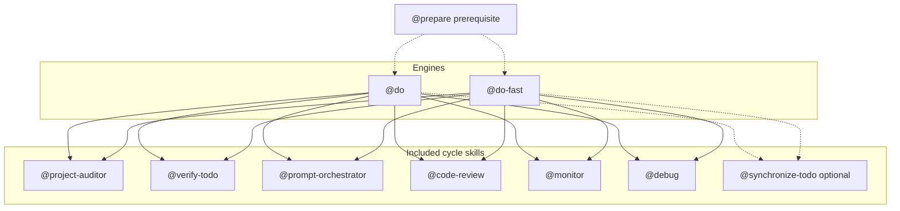
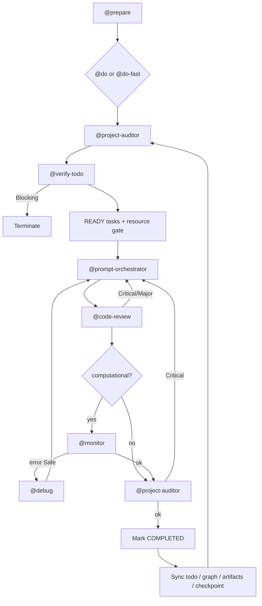
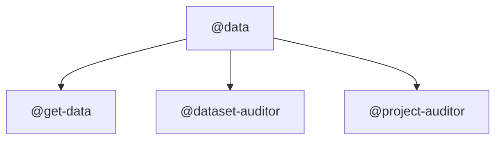
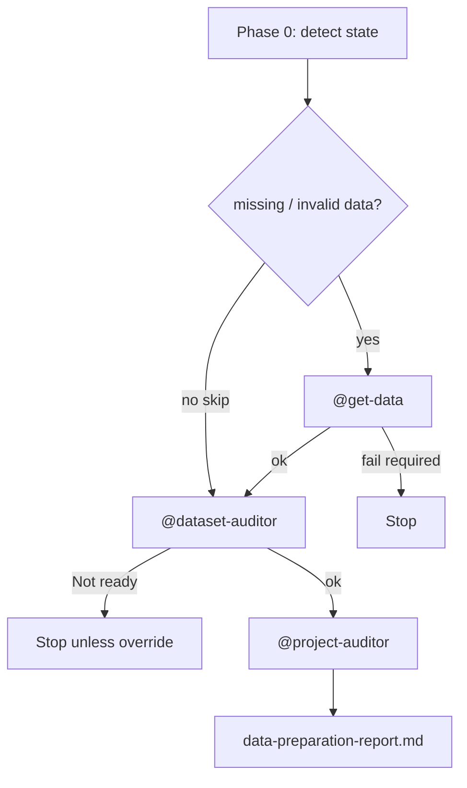
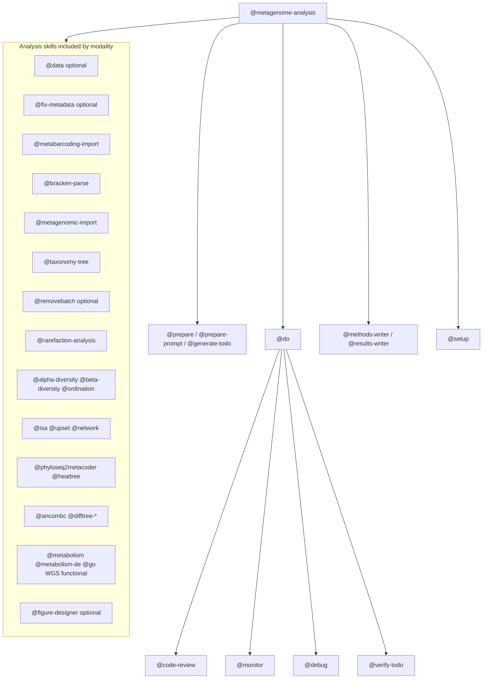
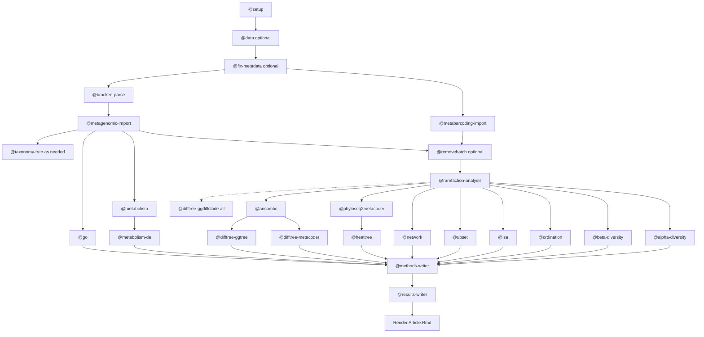
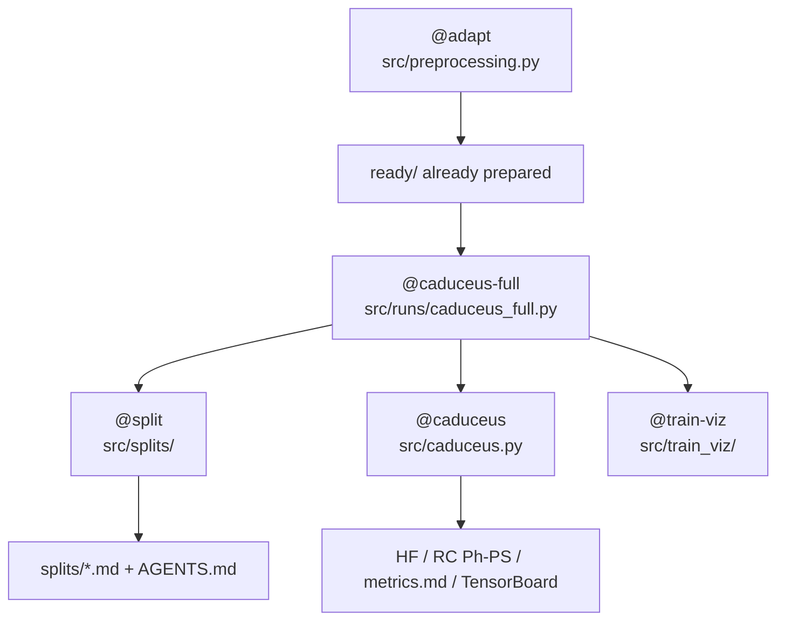
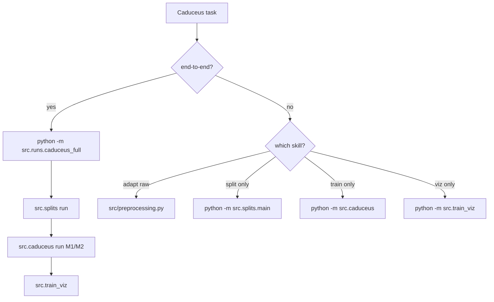

# Skills catalog

Project skills live in [`.cursor/skills/*/SKILL.md`](.cursor/skills/). **57** skills; all use `disable-model-invocation: true`. Shared templates: [`.cursor/skills/_shared/`](.cursor/skills/_shared/).

Discovery at runtime is owned by `@prompt-orchestrator` ([skills-map.md](.cursor/skills/prompt-orchestrator/skills-map.md)) — this file is a human summary, not a closed registry.

---

## Setup check (2026-07-26)

| Check | Result |
|-------|--------|
| Skill root | `.cursor/skills/` — present (git-tracked via `.gitignore` exception) |
| Skill count | **57** directories with `SKILL.md` (includes `adapt`, `train-viz`, `caduceus-full`, `analyze-ready-data`) |
| Orchestrators | `@do`, `@do-fast`, `@data`, `@metagenome-analysis`, `@caduceus`, `@caduceus-full` (+ `@prepare` / `@split`) |
| Metagenome pipeline | `metagenome-analysis/pipeline.md` — present |
| Caduceus folds | `@split` + `src/splits/` + `splits/*.md`; end-to-end via `@caduceus-full` → `src/runs/caduceus_full.py` |
| Gaps | None for catalog; runtime outs (`logs/`, `runs/`, `figures/`, `ready/`, `data_ready/`, large `splits/<id>/` fold trees) gitignored |

---

## Brief catalog

### Execution & planning

| Skill | Brief |
|-------|-------|
| `do` | Multi-step parent execution engine (auditor → verify-todo → READY waves → orchestrator → review → monitor → sync). |
| `do-fast` | One orchestrator; lean gates: full audit start+end, `@task-gate` mid-loop, code-review at end. |
| `prepare` | Sync todos, assign skills/rules, order from verify-todo graph; write prepare-report. |
| `prepare-prompt` | Create/update `./todo/*.md` from request or `todo.md`; validate via verify-todo. |
| `generate-todo` | Build hierarchical `todo.md` from architecture/specs (not `./todo/*.md`). |
| `edit-prompt` | Edit plan without executing: impact analysis, freeze completed, propagate, rollback. |
| `verify-todo` | Sole TODO dependency-graph builder/validator (`dependency-graph.md` / `.mmd`). |
| `synchronize-todo` | Reconcile `todo.md` with repo state (completed/partial/obsolete/missing). |
| `prompt-orchestrator` | Execute exactly one assigned TODO task (not a project scheduler). |
| `code-review` | Independent review vs TODO, prompt, acceptance criteria, method-decision. |
| `monitor` | Status-only supervision of long jobs (default 30m direct; 2h when inherited from do/do-fast). |
| `debug` | Safe repair of recoverable failures; escalate when unsafe. |
| `project-auditor` | Scientific project audit (reproducibility, docs, readiness); delegates methods to verify-methods. |

### Data

| Skill | Brief |
|-------|-------|
| `data` | Orchestrate data-ready: get-data → dataset-auditor → project-auditor. |
| `get-data` | Acquire public datasets (SRA/ENA/GEO/…) with manifests, checksums, logs. |
| `dataset-auditor` | Dataset QC: metadata, IDs, balance, duplicates, batch, file consistency. |
| `fix-metadata` | Align sample IDs; write `metadata_fixed.csv` when misaligned. |
| `mock-data` | Reproducible 16S/WGS/Bracken fixtures under `./test/`. |

### Metagenome / metabarcoding analysis

| Skill | Brief |
|-------|-------|
| `metagenome-analysis` | End-to-end: prepare → do → Methods/Results in `Article.Rmd` → render. |
| `setup` | Canonical `Article.Rmd` (`theme_main`, TARGET/BATCH, libraries). |
| `metabarcoding-import` | 16S → complete phyloseq. |
| `bracken-parse` | Fast Bracken/Kraken-report → wide counts + host cleanup. |
| `metagenomic-import` | WGS Bracken → complete phyloseq (+ host cleanup). |
| `taxonomy-tree` | Rebuild trees from names/taxids (rentrez → ape → ggtree). |
| `removebatch` | MMUPHin batch adjustment preserving TARGET. |
| `rarefaction-analysis` | Rarefaction curves + even-depth phyloseq. |
| `alpha-diversity` | Alpha metrics + box/raincloud by targets. |
| `beta-diversity` | PCoA (Aitchison / wUniFrac) + PERMANOVA. |
| `ordination` | sPLS-DA (default) or NMDS by targets. |
| `isa` | Indicator species + grazing Figure 3 panel set. |
| `upset` | ComplexUpset presence/absence by target. |
| `network` | NetCoMi / SparCC coexistence, chord, igraph viz. |
| `phyloseq2metacoder` | phyloseq → metacoder Taxmap. |
| `heattree` | Family (default) metacoder heat trees. |
| `ancombc` | ANCOM-BC2 multilevel taxonomic DA. |
| `difftree-metacoder` | Differential metacoder heat trees (uses prior ancombc). |
| `difftree-ggtree` | Differential ggtree; default cladobox layout. |
| `difftree-ggdiffclade` | MicrobiotaProcess `ggdiffclade` + `ggdiffbox` (alt. to ggtree). |
| `metabolism` | Bakta functional tables + top-N pheatmap (no GO). |
| `metabolism-de` | ANCOM-BC2 on product/KO/EC. |
| `go` | GO DEG + clusterProfiler enricher. |

### Caduceus / ML splits

| Skill | Brief |
|-------|-------|
| `adapt` | `src/preprocessing.py`: CDS±10kb + non-coding match → `ready/` / `data_ready/` (no folding). |
| `split` | Write/exec `src/splits/`: region folds from `raw/`+`ready/`; random → `splits/random/{M1,M2}` + `splits_log.csv`. |
| `caduceus` | Write/exec `src/caduceus.py`: fine-tune on a splits dir; `logs/` + TensorBoard + `final_model/`; `metrics.md`. |
| `train-viz` | Write/exec `src/train_viz/`: publication curves from run logs; `--models` one or compared. |
| `analyze-ready-data` | Write/exec `src/ready_analysis.py`: barplots + GC/length densities for non-coding / normal / large coding; reuse on any ready-like panel. |
| `caduceus-full` | Write/exec `src/runs/caduceus_full.py`: **no adapt**; split → caduceus(M1,M2) → train-viz (re-runnable without subagents). |
| `task-gate` | Brief post-task output/AC smoke check (not full audit or code-review). |
| `genome-fna-gtf-reformat` | Index paired `.fna`/`.gtf` genomes; optional distinct-species subsample; manifests for `@split`. |
| `genome-tpm-caduceus-reformat` | Pair genomes with TPM for fold-ready manifests (pre-split). |
| `benchmark-designer` | Design rigorous benchmarking experiments. |

### Manuscript & QA

| Skill | Brief |
|-------|-------|
| `methods-writer` | Materials & Methods from code/configs/versions (into Article.Rmd when orchestrated). |
| `results-writer` | Results prose from figures/tables/stats (observations only). |
| `figure-designer` | Nature-style figure plans, panels, captions. |
| `reviewer-response` | Point-by-point peer-reviewer rebuttals. |
| `verify-methods` | Reconstruct/update `method-decision.md`; SOTA comparison without auto-lock. |
| `visualize-architecture` | Mermaid data-flow from repo + method-decision. |

---

## Family: do & do-fast

Same inclusion set; difference is **invocation shape** (parent multi-step vs one-shot orchestrator subagent).

### Inclusion

### Dependencies

---

## Family: data

### Inclusion

### Dependencies

---

## Family: metagenome

Orchestrator: `@metagenome-analysis`. Canonical order: [pipeline.md](.cursor/skills/metagenome-analysis/pipeline.md).

### Inclusion

### Dependencies

Orchestration spine (outside analysis DAG): input analysis → `@prepare` → `@do` → writers/render → report.

---

## Family: caduceus

### Inclusion

### Dependencies

Order: ensure `ready/` (via `@adapt` / `src/preprocessing.py` if needed) → `@caduceus-full` or stage-wise `src.splits` → `src.caduceus` → `src.train_viz`. Re-run pipelines by exec of `src/` scripts (no subagents required for full). Do not invent splits or metrics.
