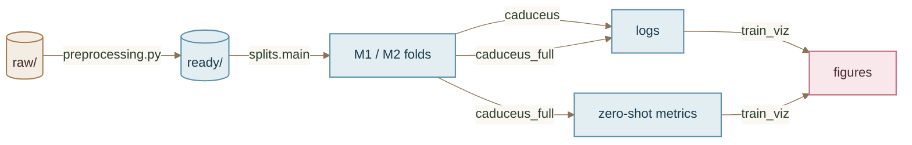

# Split & train

Use the `src/` entry points directly for the full Caduceus pipeline. This page documents the **code path only** — it does not use the old do-fast orchestration or re-run `@adapt` when `ready/` already exists.



1. `src/preprocessing.py` prepares `ready/` from `raw/` when needed.
2. `src/splits.main` or `src.splits.random.run_random_split` materializes folds.
3. `src.caduceus` trains M1 or M2 from a splits directory.
4. `src.train_viz` renders training curves.
5. `src.runs.caduceus_full` orchestrates split → train → zero-shot eval → viz.

## Preconditions

- `raw/` exists.
- `ready/` exists and already points to prepared windows, for example `ready -> data_ready`.
- Conda env `caduceus_env` is available.
- Run commands from the project root.

## 1. Prepare ready data

Skip this step when `ready/` already exists.

```bash
conda run -n caduceus_env python src/preprocessing.py \
  --raw raw \
  --out data_ready \
  --seed 42

ln -sfn data_ready ready
```

Notes:

- `src/preprocessing.py` exports **forward genomic DNA windows**.
- Current Caduceus training uses the **PS** checkpoint (`caduceus-ps`), which is RC-equivariant. It does not run forward+reverse averaging like the PH checkpoints.

## 2. Create random folds from ready data

Canonical split entry:

```bash
conda run -n caduceus_env python -m src.splits.main \
  --strategy random \
  --raw raw \
  --ready ready \
  --seed 42
```

This writes `splits/random/` with:

- `M1/{train,val,test}/` for TPM regression
- `M2/{train,val,test}/` for M1 fold prediction
- `splits_log.csv`

For the current full run, the random split code is reused through the full orchestrator and written under `output/random/splits/` instead of `splits/random/`.

## 3. Train one model directly

Train **M1** (TPM regression) from an existing splits directory:

```bash
conda run -n caduceus_env python -m src.caduceus \
  --splits-dir output/random/splits/M1 \
  --out output/random/runs/M1 \
  --epochs 10 \
  --seed 42 \
  --batch-size 2 \
  --max-length 8192
```

Train **M2** (predict M1 fold class):

```bash
conda run -n caduceus_env python -m src.caduceus \
  --splits-dir output/random/splits/M2 \
  --out output/random/runs/M2 \
  --epochs 5 \
  --seed 42 \
  --batch-size 2 \
  --max-length 8192
```

Multi-GPU training uses the same trainer via `torch.distributed.run`:

```bash
conda run -n caduceus_env python -m torch.distributed.run \
  --nproc_per_node=4 \
  --standalone \
  -m src.caduceus \
  --splits-dir output/random/splits/M1 \
  --out output/random/runs/M1 \
  --epochs 10 \
  --seed 42 \
  --batch-size 2 \
  --max-length 8192
```

Important outputs:

- `output/random/runs/M1/logs/`
- `output/random/runs/M1/tensorboard/`
- `output/random/runs/M1/final_model/`
- `output/random/runs/M1/best_model/` when validation improves

## 4. Render training figures

```bash
conda run -n caduceus_env python -m src.train_viz \
  --models output/random/runs/M1 \
  -o output/random/figures/M1
```

Compare M1 and M2:

```bash
conda run -n caduceus_env python -m src.train_viz \
  --models output/random/runs/M1 output/random/runs/M2 \
  -o output/random/figures/compare
```

## 5. Full pipeline with `src.runs.caduceus_full`

When `ready/` already exists, this is the preferred end-to-end code path.

Current full random run:

```bash
conda run -n caduceus_env python -m src.runs.caduceus_full \
  --strategy random \
  --raw raw \
  --ready ready \
  --out-root output/random \
  --seed 42 \
  --epochs-m1 10 \
  --epochs-m2 5 \
  --zs-genomes human \
  --nproc 4
```

What it does:

- reuses `src.splits.random.run_random_split`
- writes split outputs to `output/random/splits/`
- trains `M1` then `M2`
- evaluates M1 on the human zero-shot holdout
- writes figures to `output/random/figures/`
- writes a run summary to `output/random/report.md`

Useful resume helpers:

```bash
# Reuse existing split tree
conda run -n caduceus_env python -m src.runs.caduceus_full \
  --strategy random \
  --raw raw \
  --ready ready \
  --out-root output/random \
  --seed 42 \
  --epochs-m1 10 \
  --epochs-m2 5 \
  --zs-genomes human \
  --nproc 4 \
  --skip-split

# Smoke test
conda run -n caduceus_env python -m src.runs.caduceus_full \
  --strategy random \
  --raw raw \
  --ready ready \
  --out-root output/random_smoke \
  --epochs-m1 1 \
  --epochs-m2 1 \
  --no-m2 \
  --max-samples 32 \
  --nproc 1
```

## Current random output layout

```text
output/random/
  splits/
    M1/
    M2/
    zero_shot/
  runs/
    M1/
    M2/
  zs_eval/
  figures/
    M1/
    M2/
    compare/
  report.md
```

## Monitoring

```bash
tail -f logs/caduceus_full_random_resume.out
nvidia-smi
ls output/random/runs/M1/logs/
```

The first successful checkpoint for a run is usually:

- `output/random/runs/M1/logs/epoch1/metrics.json`
- `output/random/runs/M1/best_model/best_meta.json`

If those appear, the full pipeline can continue through M2, zero-shot eval, and visualization without re-splitting.
