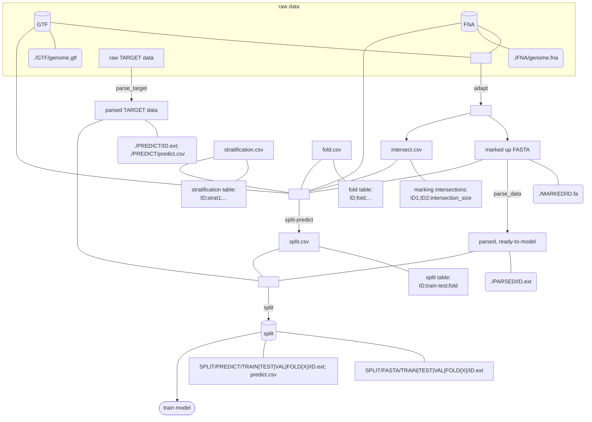

# Architecture

**Status:** target (universal tool)  
**Date:** 2026-07-28  
**Companion:** [refactoring.md](../refactoring.md)  
**Note:** Contracts and skill plan only — `src/` functions are migrated step-by-step; do not rewrite proven modules until their pytest / real-run baseline is preserved.

This page defines the **target** tool: reusable stages that any agent or user can run without Caduceus- or LegNet-only assumptions. Path labels (`MARKED/`, `PARSED/`, `PREDICT/`, `SPLIT/`) are **contracts**. Today’s `raw/` → `ready/` / `legnet_ready/` layout remains the legacy implementation until each stage lands in `src/`.

## Target pipeline

Empty nodes (`E1`–`E4`) are **join points only**. Optional `stratification.csv` / `fold.csv` may be absent; when absent, `split-predict` still writes `split.csv` from available IDs (+ strategy defaults). `intersect.csv` may be unused for `type=random`.

**Linkage:** every training ID has a prediction; ID with no gene/target → prediction **0**.

## Naming

| Concept | Name | Was / note |
|---------|------|------------|
| Mark sequences from GTF+FNA | **adapt** | New narrow stage; today’s `@adapt` → **`adapt-legacy`** |
| Serialize marked FASTA | **parse_data** | Was “parse” |
| Map raw TARGET → PREDICT | **parse_target** | Was “prepare” (pipeline stage) |
| Assign partitions | **split-predict** | Assignment half of today’s `@split` |
| Materialize folders | **split** | Copy/link half of today’s `@split` |
| Skill that runs `parse_target` | **`prepare`** (planned) | Distinct from todo-orchestrator `@prepare` — rename that orchestrator when skills migrate |
| Proven Caduceus prep skill | **`adapt-legacy`** | Current `.cursor/skills/adapt` + `src/preprocessing.py` |

## Tool functions (planned `src/` surface)

Skills are **write-and-exec** wrappers: they may author or update scripts under `./src`, then **execute** those scripts. They must not silently change behavior that already passes pytest or real runs (see project rule `skills-write-and-exec-src`).

### `id_gen`

| | |
|--|--|
| **Input** | GTF (folder), `GTF_column` (e.g. `transcript`), `outdir` |
| **Processing** | Was part of legacy adapt (interval / gene inventory) |
| **Output** | `{outdir}/ID.csv` |

**`ID.csv` columns:**

`genome | chr | pos1 | pos2 | gene_nameORnon_coding_ID | raw_target_ID | ID`

`ID` is a unique integer key for the row. This table is the natural join key for building `fold.csv` and `stratification.csv` later.

### `id_rule`

| | |
|--|--|
| **Input** | Any ID list; `ID.csv`; `ID_col_1`; `ID_col_2` |
| **Output** | Filtered / remapped ID list |

### `parse_target`

| | |
|--|--|
| **Input** | By default a folder of `{genome}.csv`; `input_type` (default `folder`); `to_type` (`legnet` \| `caduceus`); `ID_links` / `outdir` |
| **Processing** | TARGET→prediction logic formerly embedded in `@adapt` / `@legnet-adapt` |
| **Output** | `{outdir}/PREDICT/ID.ext` and `{outdir}/PREDICT/predict.csv` |

**`predict.csv` columns:** `id | predict_var1 | …`

**Skill:** `@prepare-target` executes this function (`src/pipeline/parse_target.py`). Todo-orchestrator remains `@prepare`.

### `adapt`

| | |
|--|--|
| **Input** | GTF folder, FNA folder, `outdir`, `task` (`promotor` \| `gene`), size / flank and related params (see legacy `@adapt` and `@legnet-adapt`), … |
| **Processing** | Marking / windowing formerly in featured adapt skills |
| **Output** | `intersect.csv` (legacy: `neighbours.csv`; columns `ID1|ID2|intersection_size`, default size **1**); `./MARKED/id.fa` |

**Skills:** new `@adapt` executes this function; current Caduceus prep skill moves to `@adapt-legacy` (keeps proven `src/preprocessing.py` behavior).

### `parse_data`

| | |
|--|--|
| **Input** | marked FASTA (file or `MARKED/` dir); `to_type` (`caduceus`\|`legnet`); `outdir` |
| **Output** | `./PARSED/id.ext` |

### `split-predict`

| | |
|--|--|
| **Role** | Assignment half of today’s `@split`, new architecture |
| **Input** | `outdir`; `type` (default `random`); FNA, GTF, marked_FASTA (may be omitted if `type == random`); optional `fold`, `stratification`, `stratification_column`, `intersect` |
| **Output** | `{outdir}/split.csv` |

**`fold.csv` (at least `ID` & `fold` required):**

`genome | chr | pos1 | pos2 | gene_nameORnon_coding_ID | raw_target_ID | ID | fold`

**`strat.csv` / `stratification.csv` (at least `ID` & `strat1` required):**

`genome | chr | pos1 | pos2 | gene_nameORnon_coding_ID | raw_target_ID | ID | strat1 | strat2 | …`

**`split.csv`:**

`ID | train,testORval | fold`

### `split`

| | |
|--|--|
| **Input** | `split.csv`, parsed_target (`PREDICT`), parsed_data (`PARSED`); `strategy` = `traintest` \| `traintestval` \| `fold` |
| **Processing** | Copy/link files according to `split.csv` |
| **Output** | `{outdir}/SPLIT/PREDICT/{TRAIN\|TEST\|VAL\|FOLD{X}}/id.ext` and `predict.csv`; `{outdir}/SPLIT/FASTA/{TRAIN\|TEST\|VAL\|FOLD{X}}/id.ext` |

### `train`

| | |
|--|--|
| **Input** | `model`, `type`, folders, `strategy` (wrapper around Caduceus / LegNet) |
| **Output** | Folder with model logs |

### `train-viz`

| | |
|--|--|
| **Input** | Folder with model logs |
| **Output** | Folder with visualizations |

### `adversarial`

| | |
|--|--|
| **Input** | (`outdir`) **or** (`split.csv` + parsed_target + parsed_data); `outdir_new` |
| **Output** | Same structural layout (parsed_target, parsed_data, `split.csv` → `predict.csv`) ready for another `parse_target` / train cycle |

## Stage ↔ function map

| Diagram edge | Function | Planned skill |
|--------------|----------|---------------|
| `E1` → MARKED + intersect | `adapt` | `@adapt` (new); legacy → `@adapt-legacy` |
| MARKED → PARSED | `parse_data` | (thin skill or CLI) |
| raw TARGET → PREDICT | `parse_target` | `@prepare-target` |
| `E2` → `split.csv` | `split-predict` | part of `@split` (updated) |
| `E3` → SPLIT trees | `split` | part of `@split` (updated) |
| SPLIT → logs | `train` | `@caduceus` / `@legnet` / unified `@train` |
| logs → figures | `train-viz` | `@train-viz` |
| (aux) | `id_gen`, `id_rule` | helpers used by adapt / split-predict |
| (aux) | `adversarial` | future skill |

## Artifact shapes (summary)

| Artifact | Required columns / content |
|----------|----------------------------|
| `ID.csv` | `genome\|chr\|pos1\|pos2\|gene_nameORnon_coding_ID\|raw_target_ID\|ID` |
| `intersect.csv` | `ID1\|ID2\|intersection_size` (default size 1; legacy `neighbours.csv`) |
| `fold.csv` | at least `ID\|fold` (full genomic columns optional but preferred) |
| `stratification.csv` | at least `ID\|strat1` |
| `split.csv` | `ID\|train,testORval\|fold` |
| `predict.csv` | `id\|predict_var1\|…` |
| `MARKED/id.fa` | marked sequence per ID |
| `PARSED/id.ext` | parse_data output per ID |
| `PREDICT/ID.ext` + `PREDICT/predict.csv` | parse_target outputs |

## How this differs from today’s repo

- `@adapt` / `src/preprocessing.py` collapses adapt + parse_data + parse_target into `data_ready/` + `caduceus_ready/`.
- `@legnet-adapt` is a parallel collapse into `legnet_ready/`.
- `@split` assigns **and** materializes Caduceus trees in one step (no standalone `split.csv` contract).
- Todo skill `@prepare` currently means plan execution — not `parse_target`; resolve naming when skills are migrated.

Migration order: [refactoring.md](../refactoring.md). **Do not change proven `src/` behavior until the matching stage is intentionally cut over with tests.**

## Related wiki pages

- [[conversion]] — legacy Caduceus prep (`adapt-legacy`)
- [[legnet_conversion]] — legacy LegNet prep
- [[split]] — current fold materialization
- [[Split & train]] — current Caduceus code path
