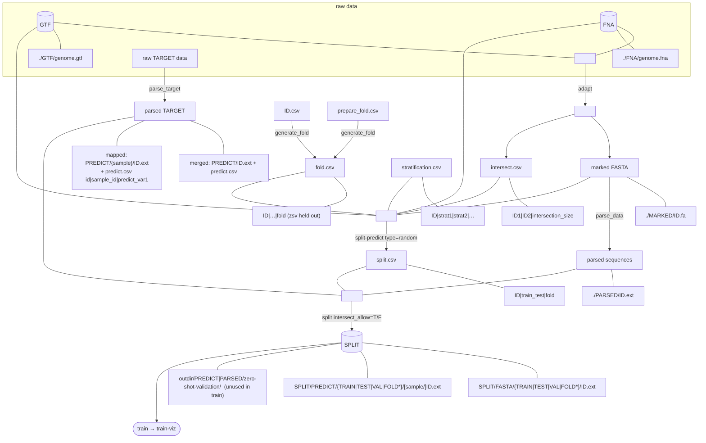

# Architecture

**Status:** current pipeline contract  
**Date:** 2026-07-28  
**Companion:** [refactoring.md](../refactoring.md)

Reusable stages under `src/pipeline/`. Path labels (`MARKED/`, `PARSED/`, `PREDICT/`, `SPLIT/`) are **contracts**. Legacy Caduceus `raw/` → `ready/` paths remain available via `@adapt-legacy` / `src/preprocessing.py` until fully retired.

## Pipeline

Empty nodes (`E1`–`E4`) are **join points only**.

**Linkage:** every training ID has a prediction; ID with no gene/target → prediction **0**.

**Incomplete panels:** LegNet `parse_data` may skip non-200 bp MARKED records. Downstream `split` uses `intersect_allow` (default **T**) to skip IDs missing PARSED/PREDICT, or **F** to raise — matching skip vs strict behaviours.

## Naming

| Concept | Name | Notes |
|---------|------|-------|
| Mark sequences from GTF+FNA | **adapt** | `environment` + `window={pos1,pos2}`; legacy Caduceus prep → `@adapt-legacy` |
| Serialize marked FASTA | **parse_data** | Caduceus DNA / LegNet 230 bp stitch |
| Map raw TARGET → PREDICT | **parse_target** | Merged or mapped sample layout |
| Build fold table | **generate_fold** | `ID.csv` + `prepare_fold.csv` → `fold.csv` (via `id_rule`) |
| Build strat table | **generate_stratification** | Stub; when done: `ID.csv` + prepare rules → `stratification.csv` via `id_rule` |
| Assign partitions | **split-predict** | Imports random assignment from `src.splits.random` |
| Materialize folders | **split** | Merged + mapped PREDICT; ZSV aside |
| Train / viz | **train** / **train-viz** | Caduceus / LegNet wrappers |

## Stage contracts

### `id_gen`

| | |
|--|--|
| **Input** | GTF (folder/file), `GTF_column`, `outdir` |
| **Output** | `{outdir}/ID.csv` |

Columns: `genome|chr|pos1|pos2|gene_nameORnon_coding_ID|raw_target_ID|ID`

`ID.csv` is the easy join table for building `fold.csv` / `stratification.csv` (via `generate_fold` / `generate_stratification` + `id_rule`).

### `id_rule`

| | |
|--|--|
| **Input** | ID list; `ID.csv`; `id_col_1`; `id_col_2` |
| **Output** | Remapped ID list (`id_col_1` values → matching `id_col_2` values) |

Required for identificator resolution in `parse_target` (prepare_target), `generate_fold`, and (when implemented) `generate_stratification`. Multi-hit keys expand to every matching `id_col_2` value in ID.csv order.

### `generate_fold`

| | |
|--|--|
| **Input** | `ID.csv`, `prepare_fold.csv` (`identificator|column|fold`), `outdir` |
| **Output** | `{outdir}/fold.csv` (ID.csv columns + `fold`) |

Example rule: `GCF_000005845.2|genome|zsv` → resolve via `id_rule` (`id_col_1=genome`, `id_col_2=ID`) and assign fold `zsv`.

### `generate_stratification`

| | |
|--|--|
| **Input** | `ID.csv`, `prepare_strat.csv` (planned rules), `outdir` |
| **Output** | `{outdir}/stratification.csv` (`ID` + strat columns) — **not written yet** |

**Status:** stub only. Emits warning `"Not implemented"` and raises / exits non-zero; does not invent stratification labels. When implemented, must resolve identificators via `id_rule` (same `id_col_1` → `ID` pattern as `generate_fold`).

### `adapt`

| | |
|--|--|
| **Input** | GTF, FNA, `outdir`, `environment=gene|random`, `window={pos1,pos2}`, … |
| **Output** | `intersect.csv`; `./MARKED/id.fa` |

### `parse_data`

| | |
|--|--|
| **Input** | MARKED; `to_type=caduceus|legnet`; `outdir` |
| **Output** | `./PARSED/id.ext` |
| **LegNet** | Exact 200 bp CRS required; default **skip** incomplete (`--strict-legnet` raises) |

### `parse_target`

| | |
|--|--|
| **Input** | TARGET folder; `ID.csv`; optional `--mappings` |
| **Output (merged)** | `PREDICT/ID.ext` + `predict.csv` (`id|predict_var1`) |
| **Output (mapped)** | `PREDICT/{sample_id}/ID.ext` + `predict.csv` (`id|sample_id|predict_var1`) |

### `split-predict`

| | |
|--|--|
| **Input** | `outdir`; `type=random\|gc` (+ future SBS types); optional `id_csv`, `fold`, `stratification`, `marked`/`fna`, … |
| **Assignment (random)** | Imports `assign_folds_random` / `assign_folds_stratified` from `src.splits.random` |
| **Assignment (gc)** | SBS: FNA/MARKED → feature table (`GC_pct`, `AAA_pct`) → cluster folds (default DBSCAN) → fold-grain train/test/val (`src.splits.gc` / `src.splits.sbs`) |
| **Stratification** | Random: all strat columns (composite key). SBS: aggregate strat **per fold** (numeric→sum, categorical→mode) then stratify fold→train/test/val |
| **fold.csv** | `zsv` / `zeroshotvalidation` → `train_test=zsv` (excluded from assignment). If omitted: warning `Warning: folds are not included` |
| **Output** | `{outdir}/split.csv` (`ID|train_test|fold`); SBS also writes `feature_table.csv`, `sbs_assignment.csv`, optional PCA figures |

SBS architecture: [sbs.md](sbs.md). Clustering uses feature tables (\(O(n\cdot d)\)), not dense distance matrices.

### `split`

| | |
|--|--|
| **Input** | `split.csv`, PREDICT root, PARSED root; `strategy`; `intersect_allow=T|F` (default **T**); optional `--sample-id` |
| **Merged** | `SPLIT/PREDICT/{bucket}/{ID}.ext` (ID from ID.csv) |
| **Mapped** | Flattened to composite unique `id={sample}__{region}`: matching PREDICT + FASTA + `predict.csv` |
| **ZSV** | `{outdir}/PREDICT\|PARSED/zero-shot-validation/{unique_id}.ext` — **not** used in train/test/val |
| **ID contract** | Pre-split checkout; materialized `predict.csv` `id` must be unique and match PREDICT/FASTA stems |
| **intersect_allow=T** | Skip IDs missing PARSED and/or PREDICT |
| **intersect_allow=F** | Raise on first missing artifact |

### `train` / `train-viz` / `adversarial`

Unchanged roles: fine-tune on SPLIT trees, plot logs, rebuild adversarial panels.

## Stage ↔ function map

| Diagram edge | Function | Module |
|--------------|----------|--------|
| E1 → MARKED + intersect | `adapt` | `src.pipeline.adapt` |
| MARKED → PARSED | `parse_data` | `src.pipeline.parse_data` |
| raw TARGET → PREDICT | `parse_target` | `src.pipeline.parse_target` |
| ID + prepare_fold → fold | `generate_fold` | `src.pipeline.generate_fold` |
| ID + prepare_strat → strat (stub) | `generate_stratification` | `src.pipeline.generate_stratification` |
| Column remap on ID.csv | `id_rule` | `src.pipeline.id_rule` |
| E2 → split.csv | `split-predict` | `src.pipeline.split_predict` |
| FNA → features (SBS) | `compute_feature_table` | `src.splits.sbs.features` |
| features → assignment (SBS) | `assign_from_features` | `src.splits.sbs.assign` |
| GC strategy | `run_gc_split_assign` | `src.splits.gc` |
| E3 → SPLIT (+ ZSV trees) | `split` | `src.pipeline.split` |
| SPLIT → logs | `train` | `src.pipeline.train` |
| logs → figures | `train-viz` | `src.pipeline.train_viz` |

## Artifact shapes

| Artifact | Required columns / content |
|----------|----------------------------|
| `ID.csv` | `genome\|chr\|pos1\|pos2\|gene_nameORnon_coding_ID\|raw_target_ID\|ID` |
| `prepare_fold.csv` | `identificator\|column\|fold` |
| `fold.csv` | at least `ID\|fold` (full genomic columns preferred) |
| `stratification.csv` | `ID` + one or more strat columns |
| `split.csv` | `ID\|train_test\|fold` (`train`/`test`/`val`/`zsv`) |
| `sbs_assignment.csv` | `region\|cluster\|train_test\|fold\|additional` (SBS strategies) |
| `feature_table.csv` | `region` + SBS feature columns (e.g. `GC_pct\|AAA_pct`) |
| `predict.csv` (merged) | `id\|predict_var1\|…` |
| `predict.csv` (mapped) | `id\|sample_id\|predict_var1\|…` |
| `intersect.csv` | `ID1\|ID2\|intersection_size` |
