# Conversion: `raw/` or BED → `legnet_ready/`

**Producer:** `src/legnet_preprocess.py` (`@legnet-adapt`)  
**Date:** 2026-07-31

```mermaid
%%{init: {'theme':'base','themeVariables':{'primaryColor':'#E8F0E6','primaryTextColor':'#2C3E2D','primaryBorderColor':'#6B8F71','lineColor':'#8B7355','secondaryColor':'#E3EEF3','tertiaryColor':'#F4EDE4','clusterBkg':'#FBF8F4','clusterBorder':'#C4B5A0','edgeLabelBackground':'#FBF8F4','fontFamily':'ui-sans-serif, system-ui, sans-serif'}}}%%
flowchart LR
    RAW[(raw/ or BED)] -->|TSS ±100 bp| CRS[200 bp CRS]
    CRS -->|gene orientation| DNA[oriented DNA]
    DNA -->|stitch adapters| OLIGO[230 bp oligo]
    OLIGO -->|TPM label| LABELED[labeled sequences]
    LABELED -->|export| OUT["legnet_ready/ · all.tsv"]

    classDef earth fill:#F4EDE4,stroke:#A67C52,stroke-width:1.5px,color:#3E2723
    classDef ocean fill:#E3EEF3,stroke:#5B8FA8,stroke-width:1.5px,color:#1A3A4A

    class RAW earth
    class CRS,DNA,OLIGO,LABELED,OUT ocean
```



## Input layouts

### From raw panel — `raw/`

```
raw/
  fna/     # genomic FASTA (.fna or .fna.gz), one file per GCF
  gtf/     # matching GTF (.gtf or .gtf.gz)
  tpm/     # wide TPM CSVs (header = gene symbols; one data row)
  random_borzoi_expr_file_mappings.csv   # id → genome (GCF) pairing
```

Pairing matches `@adapt` / `src.preprocessing.discover_raw`. Genomes without a local TPM are skipped (never invented).

### From BED — secondary mode

```
promoters.bed   # BED6: chrom start end name score strand (0-based half-open)
genome.fna      # matching reference
```

When `--stitch-adapters` is on, each interval **must** be exactly **200 bp**.

## Algorithm

1. **Discover** complete bundles (FNA + GTF + local TPM). Abort if none.
2. **TSS** — for each GTF `gene` feature, strand-aware TSS = `start` on `+`, `end` on `-` (1-based).
3. **CRS window** — 200 bp centered on TSS as 0-based half-open `[TSS−100, TSS+100)`. Skip if the window would leave the chromosome.
4. **Extract** DNA in **gene orientation** (reverse-complement if strand `-`).
5. **Stitch** lentiMPRA adapters (human_legnet / Agilent oligo design):

   ```
   AGGACCGGATCAACT  +  CRS(200)  +  CATTGCGTGAACCGA  =  230 bp
   ```

6. **Label** — continuous TPM joined by gene symbol (fallback `gene_id`). Skip genes with no TPM key.
7. **fold** — `(stable_hash(f"{seed}:{seq}") % 10) + 1` → **1..10** for human_legnet CV column only. **Not** project `@split`.
8. **Export** BED, TSV, optional FASTA, statistics/metadata JSON.

## Output: `legnet_ready/`

| Path | Format |
|------|--------|
| `promoters.bed` | `chrom start end name score strand` (score=TPM) |
| `all.tsv` | `seq_id seq mean_value fold rev` (tab; header) |
| `{GCF}.tsv` | Per-genome subset of `all.tsv` |
| `sequences.fa` | `>seq_id` + 230 bp sequence |
| `statistics.json` | Counts, skips, adapter constants |
| `metadata.json` | Provenance |

`seq` length must be **230**. `rev` is written as `0` (forward/gene-oriented export).

## Command

```bash
conda run -n legnet python src/legnet_preprocess.py \
  --raw raw --out legnet_ready --crs-bp 200 --seed 42

# Smoke (one genome, capped genes):
conda run -n legnet python src/legnet_preprocess.py \
  --raw raw --out legnet_ready_smoke \
  --genomes GCF_000001405.40 --max-genes 80

# Existing BED:
conda run -n legnet python src/legnet_preprocess.py \
  --bed promoters.bed --fasta raw/fna/GCF_000001405.40_GRCh38.p14_genomic.fna \
  --out legnet_ready --stitch-adapters
```

## Vendors

| Path | Repo | Role |
|------|------|------|
| `software/human_legnet` | https://github.com/autosome-ru/human_legnet | Primary 230 bp model |
| `software/LegNet` | https://github.com/autosome-ru/LegNet | Upstream yeast/DREAM LegNet |

Conda: `legnet` from `software/human_legnet/envs/environment.yml`.

## Skill entry

`@legnet-adapt` → `src/legnet_preprocess.py` (see `.cursor/skills/legnet-adapt/SKILL.md`).
