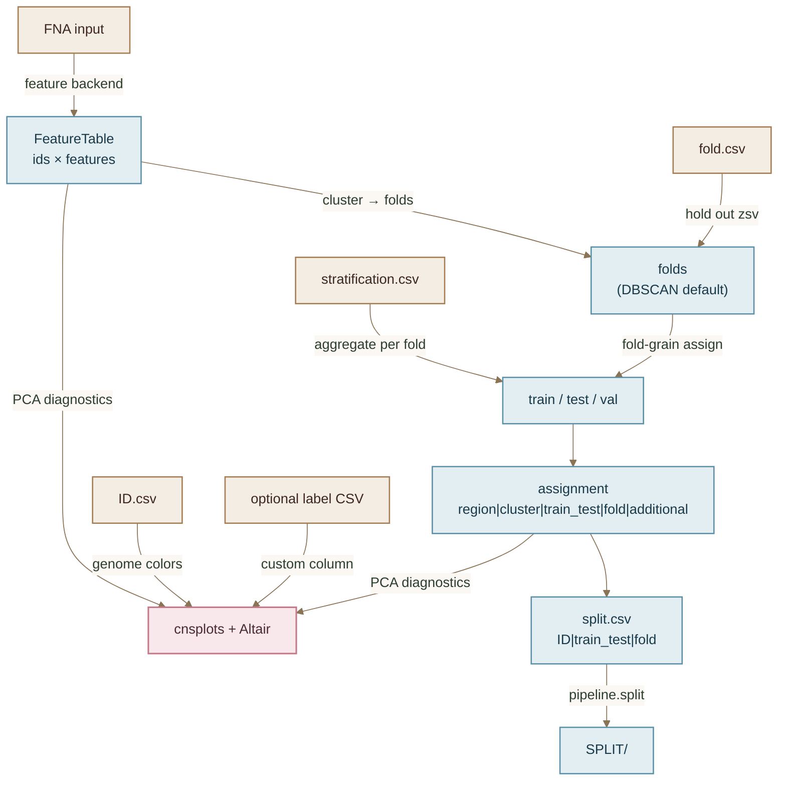

# Split-by-similarity (SBS)

**Status:** current contract  
**Date:** 2026-07-31  
**Companion:** [architecture.md](architecture.md), [split-generate.md](split-generate.md)

General architecture for similarity-aware fold assignment. Strategies (`gc`, `kmer`, …) extract a **feature table** from FNA and cluster in feature space (\(O(n\cdot d)\)), not a dense pairwise distance matrix (\(O(n^2)\)).

## Pipeline


## Two obligatory contracts (pytest)

| Contract | Input | Output |
|----------|-------|--------|
| **C1 features** | FNA (directory of one record/file, or multi-FASTA) | `FeatureTable` (`region` × feature columns) |
| **C2 assign** | `FeatureTable` (+ optional `fold.csv`, `stratification.csv`) | assignment `region\|cluster\|train_test\|fold\|additional` |

Dense `DistanceMatrix` remains only as a **legacy / small-n** helper (e.g. optional MMseqs identity); clustering must not require it.

## Modules

| Module | Role |
|--------|------|
| `src.splits.sbs.fna_io` | Load region → sequence |
| `src.splits.sbs.features` | `FeatureTable` + `compute_feature_table` |
| `src.splits.sbs.backends.gc` | `GcAaaFeatureBackend` → `GC_pct`, `AAA_pct` |
| `src.splits.sbs.assign` | Cluster on features; ZSV; fold→train/test/val |
| `src.splits.sbs.visualize` | PCA panels (cluster / train_test / genome / custom) |
| `src.splits.gc` | Strategy wrapper (`type=gc`) |

## Clustering methods

| Method | Notes |
|--------|-------|
| **`dbscan`** | **Default.** Auto `eps` from median k-distance; noise → singleton folds |
| `kmeans` | Explicit `n_clusters` or silhouette `auto` |
| `kmeans_elbow` | Inertia elbow over k |
| `hierarchical` | Average linkage on features (refused for n>5000) |
| `pca_kmeans` | PCA embed then k-means |
| `auto` | Try DBSCAN; if <2 clusters, fall back to `kmeans_elbow` |

## Assignment rules

1. **ZSV** — held out entirely from clustering / train/test/val.
2. **Cluster = fold** — non-ZSV regions clustered in feature space.
3. **Train/test/val** — assigned at **fold** grain (Caduceus-aligned ratios).
4. **Stratification** — aggregate per fold (numeric→sum, categorical→mode), then stratify fold→train/test/val.

## Diagnostics (PCA)

`plot_sbs_pca_diagnostics` writes cnsplots PDF/SVG/PNG **and** Altair HTML/VL for:

1. PCA colored by **cluster** (= fold)
2. PCA colored by **train/test/val** (+ zsv)
3. PCA colored by **genome** (`ID.csv`)
4. PCA colored by a **custom column** from a stratification-like CSV (`ID` + column)

Plus a combined Altair facet of the first three panels.

## Current GC features

| Feature | Definition |
|---------|------------|
| `GC_pct` | \(100 \times GC/(A+C+G+T)\) |
| `AAA_pct` | \(100 \times\) overlapping AAA count / \((L-2)\) |

## K-mer features (`type=kmer`)

| Backend | Module |
|---------|--------|
| `KmerFeatureBackend` | `src.splits.sbs.backends.kmer` |
| Native counter (C++) | `src.splits.sbs.backends.native` |
| Strategy wrapper | `src.splits.kmer` → `split-predict type=kmer` |

- **Production default (`engine=auto`)**: in-process abundance counter for **any `k >= 2`** (and `k=1`). Uses the **C++** library when built (`libkmer_count.so`, dense counts for `k <= 12`), else pure Python. Suitable for full-panel runs including **2-mers**.
- **Optional `engine=dsk`**: GATB DSK + `dsk2ascii` for `k >= 3` only (slow per-sequence subprocess; not the default).
- Multi-`k` concatenates columns (`k4_…`, `k5_…`); single `k` uses `kmer_…` names.
- FeatureTable stores **observed** k-mers only (relative abundance by default); counting is multiplicity, not presence/absence.

Build native lib:

```bash
python -m src.splits.sbs.backends.native.build
```

## Strategy captions

`splits/gc.md` → `src/splits/gc.py` → `split-predict type=gc`.  
`splits/kmer.md` → `src/splits/kmer.py` → `split-predict type=kmer`.
