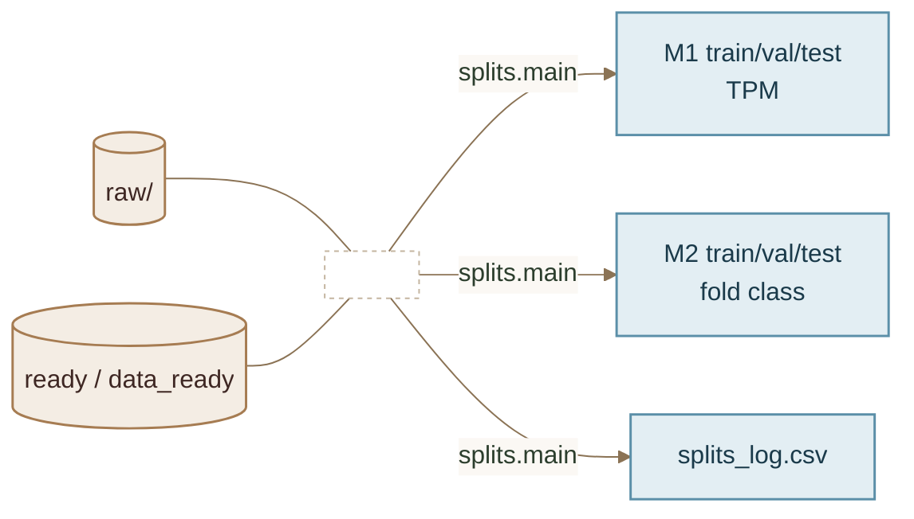

# Split: raw + ready → folds

**Code:** `src/splits/` · **Entry:** `python -m src.splits.main --strategy <id>`



## Inputs

- `raw/` — genomes/annotations/TPM (for strategies that need metadata)
- `ready/` / `data_ready/` / `ready_v2/` — prepared windows (**not** re-converted)

## Random outputs

Default: `splits/random/`. Panel-specific example (2026-07-27): `ready_v2` → `ready_splits/random/` (n=398 292; seed 42; no ZS).

| Tree | Prediction |
|------|------------|
| `M1/{train,val,test}/` | TPM |
| `M2/{train,val,test}/` | M1 fold class (stratified) |
| `splits_log.csv` | `data_input\|M1\|M2` |

```bash
python -m src.splits.main --strategy random --raw raw --ready ready_v2 \
  --seed 42 --out ready_splits/random
```

Skill workflow: **write** `src/splits/<id>.py` → **exec** main → **run** complete.
